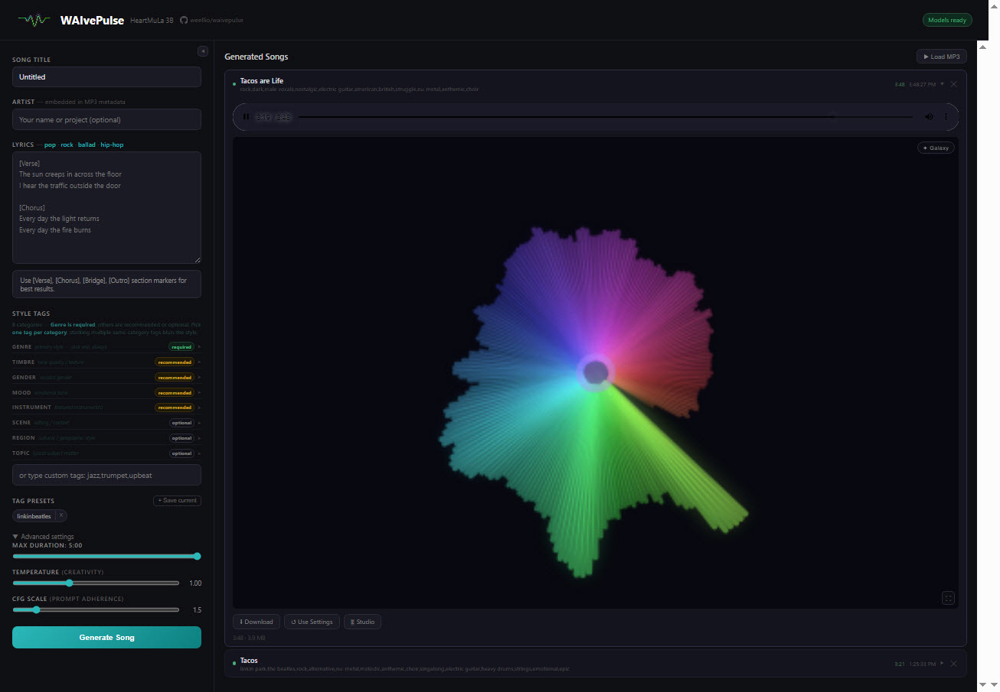
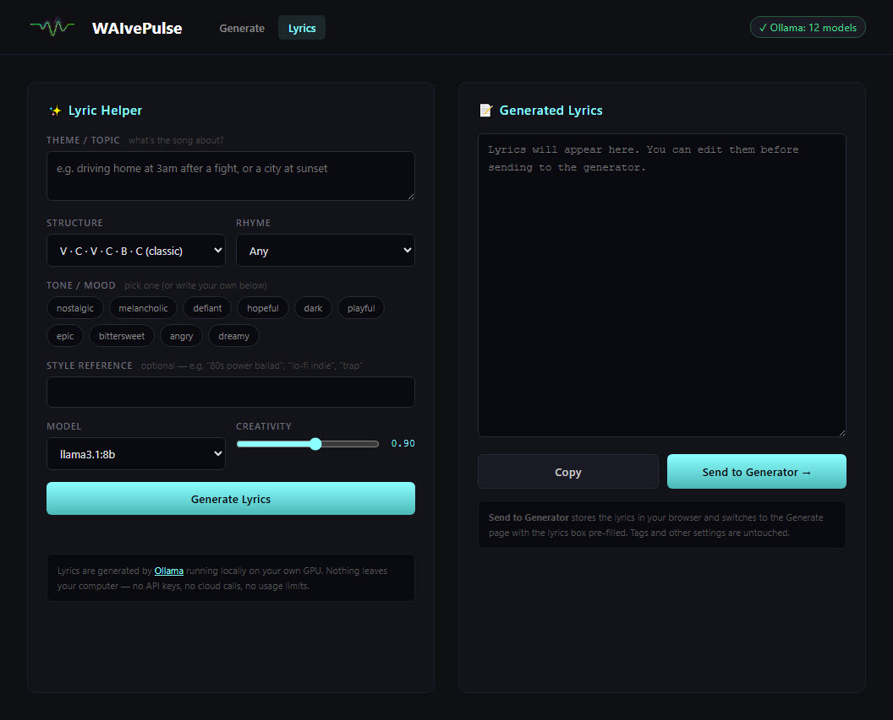
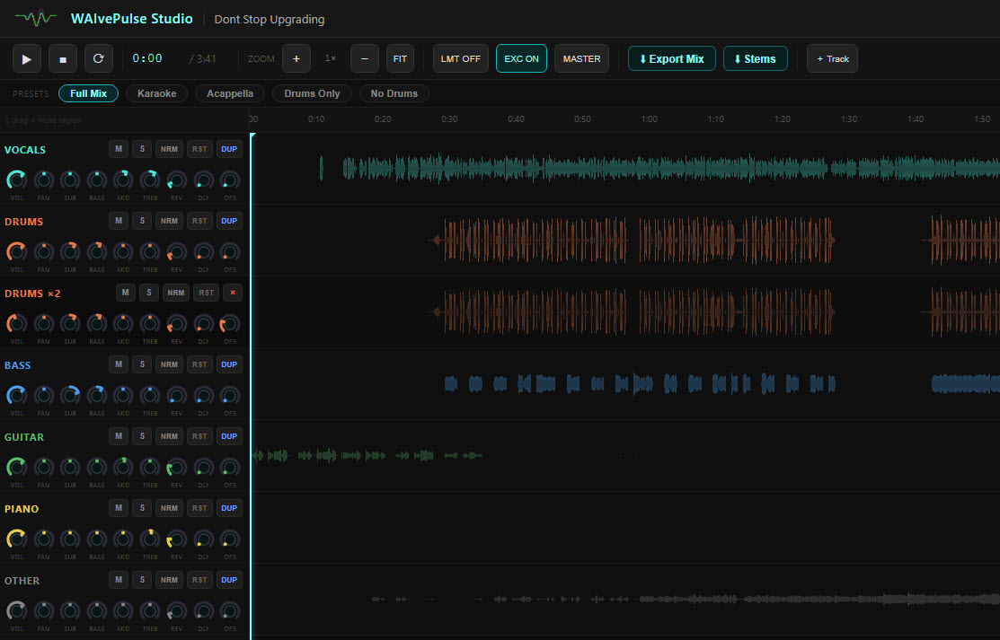
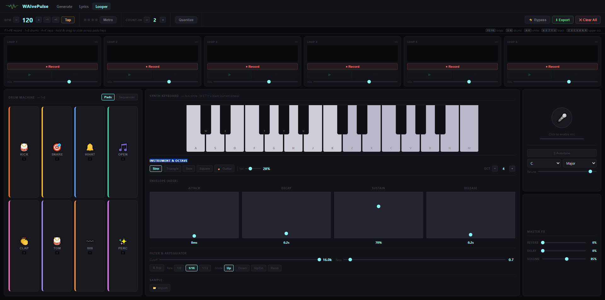
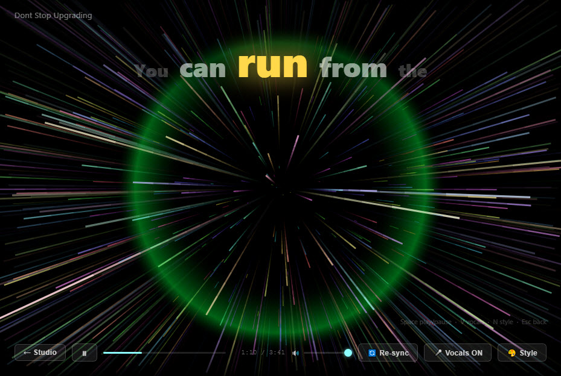

# WAIvePulse


Write a song. Generate it. Mix it. Perform it. On your own GPU.

WAIvePulse is a local AI music studio that runs five connected tools in one browser. You write lyrics (or have Llama write them for you), describe the style you want with tags, and the **HeartMuLa 3B** model generates a complete song with vocals as an MP3. You then open that song in a browser DAW that separates it into six stems, gives you a per-track mixer with mastering chain and Visual EQ, and a karaoke performance mode synced to your original lyrics. A built-in loop station lets you build original ideas layer by layer — drums, keyboard, guitar, microphone — entirely in the browser with no plugins.

No cloud. No subscription. No API keys. No usage caps.



[Watch a song made end-to-end in WAIvePulse](https://www.youtube.com/watch?v=gKttuxGeLkw) (lyric video, generated and mixed in this app).

> **Platform:** Windows 10/11 or Linux. macOS has no NVIDIA CUDA support, so HeartMuLa cannot run there.

---

## The workflow

Five pages, one ecosystem. Each page does one job. The top navigation bar links them all.

### 1. Write lyrics with Ollama



Open the Lyrics page. Pick a theme, song structure, tone, and optional rhyme scheme. Llama 3.1 (running locally via [Ollama](https://ollama.com)) streams lyrics into the output box word by word, pre-formatted with the `[Verse]`/`[Chorus]` markers HeartMuLa requires. Click "Send to Generator" and you land on the Generate page with the lyrics already filled in.

- Live token streaming, so you watch the song form in real time and can abort early if it goes wrong
- Auto-detects Ollama. If it's missing, the page shows an install card with the winget command, the Linux curl one-liner, and a download link
- Passes `keep_alive: 0` so the lyric model unloads from VRAM the moment generation ends. Lyrics, then generate, on a 12 GB card with no contention
- Pulsing dot, shimmering button, indeterminate progress bar, and glowing output panel so the UI stays alive during the 1 to 3 second model-load wait before the first token

[Detail section below](#lyric-helper-in-depth)

### 2. Generate the song with HeartMuLa

The main page. Paste lyrics, pick tags from an organised grid (Genre, Timbre, Mood, Instrument, Region, Scene, Topic), set duration and creativity, click Generate. Jobs queue in order. Each card shows the language-model token-generation phase and the audio-codec decode phase as separate progress bars with live log output.

- Multi-job FIFO queue with per-job cancel
- BPM and key auto-detection on completion (chips like `♩ 128 BPM` and `♬ A minor`)
- Seven audio visualizer styles with fullscreen mode
- ID3 metadata baked into every MP3 with title, artist, tags, temperature, CFG scale
- AudioSeal neural watermark and C2PA provenance manifest embedded when the libs are installed
- Tag presets saved to browser localStorage so your favourite combos stay one click away
- Drop external MP3s onto the history panel to play them, or to send them into Studio for stem separation

[Detail section below](#generate-page-in-depth)

### 3. Mix in Studio



Click the Studio button on any finished song card. Demucs splits the song into six stems (vocals, drums, bass, guitar, piano, other) on your GPU, then drops you into a DAW-style mixer with waveform display, per-track knobs, A-B loop, mute automation, track import, and a full master bus chain.

- **Visual EQ on every track:** click the EQ button to open a modal with a live spectrum analyzer and a draggable four-band curve, all backed by the actual biquad-filter responses
- **Master soft clipper (CLP) or limiter (LMT)**, mutually exclusive. The clipper preserves transient punch on AI music that otherwise sounds limp; the limiter glues for a louder, ballad-friendly sound
- **Harmonic exciter (EXC):** parallel 3 kHz high-pass into a soft saturator at 18% wet, for air and shimmer AI vocals lack
- **Master FX rack:** a noise gate (with duck mode), a bitcrusher + sample-rate reducer, a 4×-oversampled wavefolder, and a Dattorro plate reverb — each bypassable and baked into Export Mix
- **MASTER preset:** one click applies a starter mastering chain (drum ADT thickening, per-stem EQ, exciter, clipper, master sub and air EQ boost)
- **Mute automation:** shift-drag any waveform to draw red mute regions, baked into Export Mix
- **Track import:** drag any audio file onto the page and it becomes a full mixer track with its own knob set and loop toggle
- **Export Mix** renders a lossless WAV with every knob, EQ band, mute region, and master-chain stage baked in. What you hear is what you get

External songs work too. Drop an MP3 into the history panel, click Studio, and Demucs runs on it the same way. The full Studio feature set is available on imports.

[Detail section below](#studio-in-depth)

### 4. Build loops in the Looper



Open the Looper page at any time — it works independently of the AI generation workflow. Record up to six layered loops directly in the browser using synthesized drums, a two-octave keyboard synth, a guitar voice, or your microphone. Loops stay in sync automatically: the first recording sets the master length and every subsequent slot snaps to match.

- **Drum machine:** 8 pads (Kick, Snare, Hi-Hat, Open HH, Clap, Tom, 808, Perc) synthesized via Web Audio — keys `1`–`8` — plus a **16-step sequencer** to program patterns instead of playing live
- **Synth keyboard:** two octaves (C4–C6). Lower octave plays from the keyboard (white `A`–`K`, black `W E T Y U`); upper-octave white keys play from `Z X C V B N M`. Four oscillator waveforms plus a guitar mode that uses a periodic-wave brightness sweep for a plucked-string sound
- **Click-and-drag slide:** hold the mouse and drag across pads or keys for a glissando / drum-roll effect
- **Full ADSR envelope:** Attack, Decay, Sustain level, and Release shape every synth voice (vertical sliders)
- **Sampler:** import any audio file and pitch it chromatically across the keyboard, or record a loop and load it directly as a sample — useful for turning a beatbox vocal or bass run into a pitched instrument
- **Microphone:** live input with a built-in compressor to prevent clipping; voice goes straight into whichever loop slot is recording
- **Tempo tools:** BPM control, tap tempo, metronome, adjustable count-in, and optional quantize that snaps the first loop to the nearest bar
- **Master FX:** global reverb, delay (tempo-synced), and master volume
- **F1–F6 hotkeys** for one-finger loop triggering while both hands play instruments
- **Export Mix:** renders all active loops into a single `looper-mix.wav` download

[Detail section below](#looper-in-depth)

### 5. Perform in Karaoke



After separation, click the Karaoke button. faster-whisper transcribes the vocals stem on demand, an LCS algorithm aligns the transcript to your original lyrics (correcting misheard words), and a fullscreen performance page opens with a five-word sliding lyric window, 20+ visualizer styles, and your Studio mix carried over intact.

Capture the Karaoke playback with a screen recorder (OBS, Windows Game Bar, NVIDIA ShadowPlay, QuickTime) and you have a lyric video with synced words and a tuned mix, ready to upload to YouTube. WAIvePulse does not record video itself; it produces the visual and audio you record.

[Detail section below](#karaoke-in-depth)

---

## Why WAIvePulse

| | WAIvePulse | Cloud song generators (Suno, Udio) | Pro DAWs (Logic, Ableton) |
|---|---|---|---|
| Runs offline | Yes | No | Yes |
| Open source | Yes | No | No |
| Generates songs from lyrics | Yes | Yes | No |
| Browser-based stem mixer | Yes | No (or extra fee) | N/A (native) |
| Karaoke or lyric video output | Yes | No | No (manual) |
| Loop station (drums, synth, guitar, mic) | Yes | No | External plugin |
| Subscription | None | Monthly | Monthly or one-time |
| Usage cap | None | Tokens or credits | None |
| Your lyrics or audio leave your computer | Never | Always | Never |

For a solo producer with a 12 GB+ NVIDIA GPU, the trade is a one-time install plus a 21 GB model download in exchange for permanent freedom from cloud lock-in.

---

## System requirements

| Component | Requirement |
|---|---|
| OS | Windows 10/11 or Linux |
| GPU | NVIDIA with ~12 GB VRAM (CUDA required) |
| Python | 3.10+ |
| Disk | ~25 GB (HeartMuLa + HeartCodec weights) plus working space |
| Optional | `librosa` (BPM and key chips), `audioseal` + `c2pa` + `cryptography` (watermarking), `faster-whisper` (Karaoke lyric sync), `demucs` (Studio stem separation), `ffmpeg` (MP3 stem output), Ollama (lyric writing) |

`setup.sh`/`setup.bat` installs the required Python packages and downloads the model weights. You do not need to install any of these by hand.

---

## Quick start

### First-time setup (run once)

**Windows:**

```batch
setup.bat
```

**Linux:**

```bash
bash setup.sh
```

The script installs Python, ffmpeg, and git if missing; checks your NVIDIA and CUDA versions; creates a Python virtual environment; installs PyTorch with the right CUDA build, heartlib, and dependencies; then downloads the HeartMuLa weights (~21 GB).

The default install location is `~/HeartMuLa/` (Linux) or `%USERPROFILE%\HeartMuLa\` (Windows). To install somewhere else, set `WAIVEPULSE_VENV` and `WAIVEPULSE_CKPT` before running setup.

### Launch (every time)

**Windows:**

```batch
start.bat
```

**Linux:**

```bash
bash start.sh
```

Open **http://localhost:7861** in any browser. The launcher kills any old server process on port 7861 before starting.

---

## Reference

What follows documents each page in detail, plus the file structure, API surface, technical implementation, configuration, and troubleshooting. Skip to the section you need.

---

## Generate page (in depth)

### Song title

Optional label. Used as the filename and the display name in the history panel.

### Artist

Optional. Embedded into the MP3 as the ID3 Artist tag. Leave blank and it defaults to `WAIvePulse`.

### Lyrics

HeartMuLa was trained on lyrics with section markers, and it produces better songs when you use them. Supported markers:

```
[Intro]
[Verse]
[Prechorus]
[Chorus]
[Bridge]
[Outro]
```

Minimal working example:

```
[Verse]
The city lights shine bright tonight
I walk alone beneath the open sky

[Chorus]
Feel the rhythm, feel the beat
Dancing through the crowded street
```

Use the template links (pop, rock, ballad, hip-hop) above the lyrics box to load a full example you can edit.

### Tags

Tags tell HeartMuLa what the song should sound like. HeartMuLa was trained with eight tag categories, each shaping a different dimension of the output. The UI groups them in collapsible sections so you pick deliberately.

**The rule that matters most: one tag per category.** The model was trained on examples where each category had a single value. Stacking multiple tags in one category (e.g. `pop,rock,jazz`) averages them into something muddier than any one would produce alone.

| Category | Importance | What it shapes |
|---|---|---|
| Genre | Required | The core musical style. Always pick one. |
| Timbre | Recommended | Tone and texture. Bright vs dark, warm vs harsh, smooth vs gritty. |
| Gender | Recommended | Vocalist sounds male, female, or mixed. Also `no vocals` for instrumentals. |
| Mood | Recommended | Emotional colour. Nostalgic, epic, melancholic, playful, etc. |
| Instrument | Recommended | A featured instrument the model will try to push to the front. |
| Scene | Optional | A setting that shapes atmosphere. Coffee shop, stadium, late night. |
| Region | Optional | Cultural flavour. `british` pulls toward melodic rock, `latin` adds rhythmic warmth. |
| Topic | Optional | Lyrical subject. Reinforces what you wrote in the lyrics box. |

A clean combo: `rock,dark,male vocals,nostalgic,electric guitar,british`. One per category, covers the most influential dimensions.

Avoid: `pop,rock,jazz` (three Genre tags) or `happy,melancholic,dark` (conflicting Mood tags).

Blending two artists: the model doesn't know artist names, so describe what makes each distinctive across different categories. To blend Linkin Park and The Beatles, try Genre `rock`, Timbre `dark`, Region `british` (the key Beatles lever), Mood `nostalgic`, Instrument `electric guitar`. Each tag pulls from a separate category, so they reinforce each other instead of fighting.

Type freeform tags in the custom field below the grid (comma-separated) for sub-genre descriptors like `nu-metal`, `anthemic`, or `chamber pop`.

### Tag presets

Click "+ Save current" next to "Tag Presets" to save your active tag selection under a name. Saved presets appear as chips. Click a chip to apply it, click × to delete it. Presets live in browser localStorage and persist across sessions.

### Advanced settings

| Setting | Default | Range | Description |
|---|---|---|---|
| Max Duration | 5:00 | 0:30 to 5:00 | Upper limit on song length. The model may stop earlier at a natural end. |
| Temperature | 1.0 | 0.5 to 2.0 | Higher = more creative and unpredictable. Lower = more conservative and structured. |
| CFG Scale | 1.5 | 1.0 to 5.0 | How strictly the output follows your tags. Higher = stronger style adherence. |

### Generate

Click "Generate Song". The button re-enables right away so you can queue another request. The worker runs one job at a time; the rest wait.

Each job card shows two progress bars during generation:

- **Language model**: token generation (phase 1)
- **Audio codec**: waveform decode (phase 2)

Plus a live log scrolling raw output from the model. Amber pulsing dot = generating, green dot = done.

### Completed cards

Each finished card has an audio player with seven visualizer styles (click the style button to cycle, or double-click the visualizer to go fullscreen), plus:

- **Download:** save the MP3 to disk
- **Use Settings:** load this song's lyrics, tags, and artist back into the form for a re-roll
- **Studio:** open the stem-separation Studio for this song
- **Karaoke:** open the karaoke performance page once separation has finished
- **Cancel:** for queued or generating jobs only
- Duration, file size, BPM, and key chips

Visualizer styles:

| Style | Description |
|---|---|
| Ring | Circular frequency bars around a glowing core |
| Bars | Vertical frequency spectrum with glow |
| Wave | Mirrored waveform fill |
| Galaxy | Rotating starburst, lines radiate from centre coloured by frequency |
| Aurora | Layered flowing sine bands, like northern lights |
| Particles | Frequency-reactive particles that scatter outward and drift with gravity |
| Scope | Stabilised oscilloscope with zero-crossing lock |

Double-click any visualizer (or click the fullscreen icon) to launch it fullscreen, good for a TV or second screen. Move the mouse to reveal style-cycle and exit controls. Press Escape to leave.

ID3 metadata embedded in every generated MP3:

| Tag | Value |
|---|---|
| Title | Song title |
| Artist | Your input, or "WAIvePulse" if blank |
| Album Artist | WAIvePulse |
| Composer | HeartMuLa 3B |
| Genre | Full tags string |
| Year | Current year |
| Encoded by | WAIvePulse / HeartMuLa 3B |
| Comment | `Tags: ... | Temperature: ... | CFG Scale: ...` |

### Load MP3 (external songs)

Click the "Load MP3" button to import local audio files into the history panel. Drag and drop also works for MP3, WAV, FLAC, OGG, M4A onto the right-hand panel.

Loaded files play and visualize in the browser. Click the Studio button on a loaded card and the file is uploaded server-side (via `POST /upload`) and Demucs runs on it the same way as a generated song. The full Studio feature set works on imports: stem mixer, mute regions, Visual EQ, MASTER preset, master bus chain, Export Mix, Karaoke.

One caveat. If you bookmark a Studio URL for a loaded MP3 and reopen it in a fresh browser session, the in-memory file reference is gone. Go back to the main page, drop the MP3 again, and click Studio. Songs generated by WAIvePulse and songs imported via the upload flow live server-side and never hit this limit.

### Generation time

Approximate times on a mid-range 12 GB GPU. Your hardware will vary.

| Duration | LM Tokens | Approx. time |
|---|---|---|
| 30 seconds | ~375 tokens | 10 to 12 min |
| 1 minute | ~750 tokens | 20 to 25 min |
| 2 minutes | ~1500 tokens | 40 to 50 min |
| 3 minutes | ~2250 tokens | 60 to 80 min |
| 5 minutes | ~3750 tokens | 100 to 130 min |

Two phases run sequentially:

1. Language model phase, autoregressive audio token generation, ~1.5 tokens/sec
2. Codec decode phase, audio tokens to waveform, ~41 sec/step, ~10 steps per ~30s of audio

Both phases stream live in the browser via the job card.

---

## Lyric Helper (in depth)


Open `/lyrics` or click "Lyrics" in the top nav. Generation runs entirely on your local GPU via Ollama. No API keys, no cloud calls, no usage limits.

### Lyric Helper features

- Theme/topic input, song-structure dropdown (V-C-V-C-B-C and variants), 10 tone chips, optional rhyme scheme and style reference
- Model picker auto-populates from your installed Ollama models. Defaults to `llama3.1:8b` if available.
- Creativity slider (0.4 to 1.3 temperature)
- Live streaming output. Lyrics appear word by word in the textarea as Ollama generates them. A pulsing dot inside the button, a shimmering button gradient, an indeterminate progress bar, and a glowing output panel run in parallel so the UI stays alive even before the first token arrives.
- Section markers (`[Verse]`, `[Chorus]`, etc.) baked into the system prompt so output matches HeartMuLa's expected format
- "Send to Generator" stores the lyrics in `localStorage` and bounces you to the main page with the lyrics box pre-filled
- The final status line reports elapsed time and token count

### Ollama setup

If Ollama isn't installed or isn't reachable, the page renders an inline install card above the form with three steps:

1. **Install Ollama.** Windows: `winget install Ollama.Ollama`. Linux: `curl -fsSL https://ollama.com/install.sh | sh`. Or download the installer from [ollama.com](https://ollama.com/download).
2. **Pull a lyric model.** `ollama pull llama3.1:8b` (~5 GB, recommended) or `ollama pull llama3.2:3b` (~2 GB, smaller-VRAM fallback).
3. **Refresh the page.** The badge in the top-right turns green when Ollama is detected.

If Ollama is running but no models are installed, the card shrinks to the pull-model step only.

### VRAM contention with HeartMuLa

The Lyric Helper passes `keep_alive: 0` to Ollama on every request, so the model leaves VRAM the moment generation finishes. On a 12 GB card the Lyrics-then-Generate workflow is safe: by the time you click "Generate Song", the ~5 GB Llama allocation is gone and HeartMuLa loads into a clean slate.

If you do hit `CUDA out of memory`, the error message in the job card lists the three common causes (Ollama still loaded, a prior crash leaked memory, another GPU app running).

---

## Studio (in depth)


Click the Studio button on any finished song card. The Studio page runs Demucs (Facebook Research) on the song to separate it into up to six stems, then opens a DAW-style mixer.

### Setup

- `demucs` in your Python environment. Included in `requirements.txt`.
- `ffmpeg` on your PATH for MP3 stem output. Falls back to WAV if missing.
  - Linux: `sudo apt install ffmpeg`
  - Windows: `winget install ffmpeg`
- Separation runs on your GPU and takes a few minutes per song.

### Stems

| Stem | Contents |
|---|---|
| Vocals | Lead and backing vocals |
| Drums | Drum kit and percussion |
| Bass | Bass guitar and low end |
| Guitar | Electric and acoustic guitar |
| Piano | Piano and keys |
| Other | Everything else |

### Presets

One-click buttons above the mixer apply common stem combinations:

| Preset | What's audible |
|---|---|
| Full Mix | All stems |
| Karaoke | Everything except vocals (sing along) |
| Acappella | Vocals only |
| Drums Only | Drums only |
| No Drums | Everything except drums |

### A-B loop

Drag on the ruler to mark a loop region. A cyan highlight shows the selected range. Enable the loop button and playback repeats inside that region. ESC clears the loop.

### Mute automation

Draw mute regions on any waveform to silence a track for a specific section. Useful for an acappella refrain, a drum solo, or an instrumental bridge.

- Shift-drag on a waveform draws a red mute region for that track
- Click inside a mute region to delete it
- Regions on the same track auto-merge if they overlap or sit within 50 ms of each other
- Mute regions play live and bake into Export Mix
- Sidebar header reminds you: `⇧ drag = mute region`

### Track import

Bring any audio file in as an extra mixer track. A sample, a loop, a scratch vocal, anything.

- "+ Track" button in the transport bar opens a file picker (MP3, WAV, FLAC, OGG, M4A, AAC)
- Drag and drop one or more audio files onto the Studio window. A fullscreen drop target appears.
- Imported tracks appear below the stem tracks with the same full knob set (VOL, PAN, EQ, REV, DLY, OFS)
- Loop toggle on imported tracks repeats a short sample for the full song duration
- × button removes the imported track
- Loop state is respected in Export Mix
- Imported tracks render in gold in the waveform view so they're easy to spot

### Per-track Visual EQ

Click the EQ button on any track strip to open a modal with:

- A live spectrum analyzer tapped after the EQ chain, so you see exactly the post-EQ signal
- The combined EQ curve drawn from each band's actual biquad response via `getFrequencyResponse()` (no approximations)
- Four coloured draggable points (SUB cyan, BASS blue, MID yellow, TREB orange) sitting at their corner or centre frequencies
- Drag vertically to set gain, scroll the wheel over a point for fine adjustment, hold Shift for 0.1 dB steps
- Live readouts under the canvas
- A "RESET EQ" button to flatten all four bands
- Hi-DPI canvas (devicePixelRatio scaling) for crisp lines on Retina or 4K

Changes sync live with the mixer-strip knobs. Press Escape to close.

### Master bus chain

Signal path on the master bus:

```
Track sends -> Master Bus -> Sub EQ (60 Hz lowshelf) -> Air EQ (10 kHz highshelf)
            -> [Gate] -> [Crusher] -> [Wavefolder] -> FX Out -> [LMT or CLP] -> Master Volume -> Output
                                                            |-> Exciter (parallel) ------------------^
                                                            \-> Plate reverb (parallel send) --------^
```

The gate, crusher and wavefolder are serial inserts (off by default, bypassed when off); the exciter and plate reverb are parallel sends. All of them, plus the limiter/clipper, are reproduced exactly in Export Mix.

**LMT vs CLP, pick one.** They sit at the same point and target the same problem (peaks) with different methods.

| | LMT (Limiter) | CLP (Clipper) |
|---|---|---|
| Method | DynamicsCompressor, −18 dB threshold, 4:1 ratio, fast attack | tanh-bent waveshaper, knee ≈−4.4 dBFS, ceiling −0.5 dBFS, 4× oversampled |
| Effect on transients | Ducks them. Envelope follower clamps gain when input exceeds threshold | Bends them at the ceiling. Instant, sample-by-sample |
| Sound | Glued, radio-ready, can feel squashed | Punchy, transients survive, can add mild harmonic distortion if pushed |
| Best for | Vocal-forward mixes, ballads, anything where average loudness matters more than transient detail | Drum-forward mixes, anything where kick and snare snap matter. AI-generated music that feels limp. |
| Use when | You want loudness glue and don't mind softer drums | You want loudness without losing impact (a sensible default for AI music) |

Clicking either button automatically disables the other.

### Controls

A blank Hotkey cell means the control is mouse-only.

| Group | Control / action | Hotkey | What it does |
|---|---|---|---|
| Transport | Play / pause | `Space` | Toggle playback |
| Transport | Stop | `Home` | Stop and return to start |
| Transport | Jump to end of song | `.` | Seek to the end |
| Transport | Nudge playhead | `←` / `→` | Seek back / forward 2 seconds |
| Transport | Jump playhead | `Shift+←` / `Shift+→` | Seek back / forward 10 seconds |
| Transport | Click anywhere on a waveform or ruler | | Seek to that position |
| Track select | Click a track strip or waveform row | | Selects that track (cyan highlight) |
| Track select | Cycle next / previous track | `Tab` / `Shift+Tab` | Selection follows highlight |
| Track ops | Mute | `M` or click `M` button | Silence selected track |
| Track ops | Solo | `S` or click `S` button | Hear only soloed tracks (multiple solos OK) |
| Track ops | Normalize | `N` or click `NRM` | Bring peak to ~−0.5 dBFS |
| Track ops | Reset all knobs on track | `R` or click `RST` | Per-track reset to defaults |
| Track ops | Duplicate track | `D` or click `DUP` | Independent copy with its own knobs (use OFS for ADT) |
| Track ops | Visual EQ | click `EQ` | Live spectrum + draggable 4-band curve modal |
| Knobs | Drag VOL / PAN / SUB / Bass / Mid / Treb / Rev / Dly / OFS | | Drag up-down or scroll wheel |
| Knobs | Reset a single knob | double-click knob | Back to default value |
| A-B loop | Drag on the ruler | | Mark a loop region (cyan highlight) |
| A-B loop | Set loop IN at playhead | `[` | Marks the loop start |
| A-B loop | Set loop OUT at playhead | `]` | Marks the loop end |
| A-B loop | Toggle loop | `L` or click loop button | Repeat playback inside the marked region |
| A-B loop | Clear loop region | `Esc` | Removes the marked region |
| Mute regions | Paint mute region on a track | `Shift` + drag on waveform | Draws a red mute region for that track |
| Mute regions | Delete one region | click inside the region | Removes that region |
| Mute regions | Clear all on selected track | `Delete` / `Backspace` | Wipes every mute region on the track |
| Track import | Drag clip block left / right | | Reposition the imported clip on the timeline |
| Track import | Toggle loop on imported track | click loop icon | Short sample repeats for full song |
| Track import | Remove imported track | click × on the strip | Drops the import |
| Master bus | Harmonic exciter | click `EXC` | Parallel 3 kHz saturation at 18% wet |
| Master bus | Limiter | click `LMT` | Master limiter (turning on disables CLP) |
| Master bus | Soft clipper | click `CLP` | Master clipper at −0.5 dBFS (turning on disables LMT) |
| Master FX | Noise gate | click `GATE` | Dual-threshold hysteresis gate, attack/hold/release; `DUCK` inverts it |
| Master FX | Bitcrusher | click `CRUSH` | Bit-depth + sample-rate reduction (`bits` / `rate` sliders) |
| Master FX | Wavefolder | click `FOLD` | 4×-oversampled wavefolder (`drive` slider) for added harmonics |
| Master FX | Plate reverb | click `PLATE` | Dattorro plate reverb, parallel send (`mix` slider) |
| Master bus | Apply mastering preset | `Ctrl+Shift+M` or click `MASTER` | Full one-click mastering chain across stems |
| Master bus | Master volume slider | drag slider | 0 to 150%, baked into Export Mix |
| Master bus | Reset every track | click `RST ALL` | All knobs on all tracks to defaults |
| Zoom | Zoom in | `+` / `=` | Wider waveforms, finer editing |
| Zoom | Zoom out | `−` | Tighter waveforms |
| Zoom | Fit | `F` | Reset zoom to show the full song |
| Zoom | Pan horizontally when zoomed | scroll on a waveform | Vertical wheel scrolls horizontally |
| Export | Export Mix to WAV | `Ctrl+E` or click button | Renders full mix with every setting baked in |
| Export | Download stems ZIP | click `Stems` button | All six raw separated stems |
| Karaoke | Open Karaoke page | click `Karaoke` button | Fullscreen visualizer + synced lyrics |
| Help | Open / close help modal | `?` or `H` | In-app shortcut reference |
| Help | Close any open modal | `Esc` | Closes EQ modal, help modal, or clears loop |

Pressing `?` or `H` inside Studio opens the same reference in-app.

### Export Mix (what's baked in)

Everything you hear in the Studio is rendered into the exported WAV, including the limiter and clipper:

- Per-track: volume, pan, SUB/Bass/Mid/Treb EQ, reverb send, delay send, offset (OFS), mute regions, looped imports, clip start position
- Master bus: Sub EQ, Air EQ, exciter, limiter (LMT), clipper (CLP), master volume

Solo and mute states are honoured. Imported tracks that are short and have loop enabled loop for the full render duration.

### Notes

- Separation and generation share the same job queue. Only one runs at a time, to avoid VRAM conflicts.
- Stems are cached. Clicking Studio again on the same song loads instantly.
- The `?sep=` URL parameter lets you bookmark or share a direct link to a finished separation.
- The MASTER preset enables the clipper (CLP), not the limiter. Click LMT manually if you prefer the glued limiter sound.

---

## Karaoke (in depth)


Click the Karaoke button in the Studio transport bar (enabled once separation is done) to open a fullscreen performance page.

| Feature | Description |
|---|---|
| Five-word lyric window | Active word highlighted in amber; two words each side dimmer and smaller (the sliding-window style used by professional karaoke) |
| Lyrics sync | Whisper transcribes the vocals stem on demand; an LCS algorithm aligns Whisper's transcript to your original lyrics to correct misheard words |
| Studio mix passthrough | Karaoke carries your full Studio mixer settings. Per-track volume, pan, EQ, reverb, delay, offset, mute regions, and the full master bus chain (EQ, exciter, limiter, clipper, master volume) all play on the karaoke page. What you hear in Studio is what plays during recording. |
| Vocals toggle | V key or button mutes or unmutes the vocals stem in real time. Karaoke mode = vocals off, sing-along mode = vocals on. |
| Intro handling | Lyrics stay hidden during instrumental intros and slide into view about 3 seconds before the first sung word |
| Visual styles | 20+ styles including Galaxy, Aurora, Bars, Scope, Hypertube, Kaleidoscope, Bubbles, Lasers. Press N to cycle. |
| Auto-transcribe | "AUTO TX" toggle in the Studio transport. When on, Whisper runs in the background right after separation so Karaoke opens instantly. |
| Keyboard | Space play/pause, V vocals toggle, N next style, Left/Right seek ±5s, Esc back to Studio |

**Screen-recording flow:** dial in your mix in Studio, open Karaoke, then record your screen with OBS, Windows Game Bar, NVIDIA ShadowPlay, or QuickTime. You get a lyric video with synced sliding words and a fully tuned mix that you can upload to YouTube. WAIvePulse does not record video itself; it produces the visual and audio you record.

### Setup

Karaoke requires `faster-whisper`. It is in `requirements.txt` and the setup script installs it.

```
pip install faster-whisper
```

Without `faster-whisper`, Karaoke still works. It plays the song with the visualizer and no lyric sync.

---

## Looper (in depth)


Open `/looper` or click "Looper" in the top nav. The page runs entirely in the browser using the Web Audio API — no server calls, no GPU required. Everything you record is captured with an AudioWorklet that runs on the browser's dedicated audio rendering thread, avoiding the main-thread glitches that cause crackling in older Web Audio approaches.

The layout is a full-width row of six loop slots across the top, with the instruments below: drum machine on the left, the two-octave keyboard in the center, and microphone plus Master FX on the right.

### How looping works

The first slot you record sets the **master loop length**. Every subsequent slot auto-stops recording at exactly the end of that master cycle, so all loops stay in perfect sync without manual timing. Press F1–F6 (or click Record on a slot) to start, press again to stop. If count-in is enabled the slot waits for the metronome to count down before recording begins.

Each slot plays back independently in a continuous loop. Slots can be muted (⏸), cleared (✕), or loaded into the sampler keyboard (🎹 Use as Sample). Per-slot volume sliders let you balance the mix while everything plays.

### Instruments

#### Drum machine

Eight synthesized pads, triggered by clicking or pressing keys `1`–`8`.

| Pad | Key | Sound |
|---|---|---|
| Kick | `1` | 808-style sine sweep with sharp transient |
| Snare | `2` | Bandpass noise burst + tone body |
| Hi-Hat | `3` | Short high-pass noise burst |
| Open HH | `4` | Longer open hi-hat decay |
| Clap | `5` | Three overlapping noise layers |
| Tom | `6` | Descending pitch-sweep oscillator |
| 808 | `7` | Sub-bass sine with soft waveshaper distortion |
| Perc | `8` | Short triangle-wave transient |

All drums are synthesized in real time — no sample files on disk.

#### Step sequencer

Click **Sequencer** in the Drum Machine header to switch from live pads to a 16-step grid — one row per drum, color-coded. Click cells to toggle hits, then press **▶ Play** to run the pattern. Programming a beat this way is far easier than nailing the timing live.

- 16 steps at 16th-note resolution, locked to the current BPM
- The playing step highlights as it scrolls, so you can see the pattern move
- Runs alongside live pad hits and the keyboard — record the sequencer output into a loop slot like any other instrument
- Changing BPM (including via tap tempo) restarts the sequencer in sync

Switch back to **Pads** at any time; the pattern is preserved.

#### Synth keyboard

Two octaves (C4–C6) displayed as a piano keyboard.

- **Lower octave** is keyboard-playable in the GarageBand "musical typing" style: white keys `A S D F G H J K`, black keys `W E T Y U`
- **Upper-octave white keys** play from the bottom row `Z X C V B N M` (D → C). The upper-octave black keys are mouse/drag only
- **Octave shift** (− / +) moves the whole keyboard between octaves 1 and 6 so the typing keys can reach any range
- **Click-and-drag slide:** hold the left mouse button and drag across the keys for a glissando — it plays each note (including black keys) as you pass over and releases it as you leave. The same drag works across the drum pads for rolls.

**Instrument modes:**

| Mode | How it works |
|---|---|
| Sine / Triangle / Saw / Square | Oscillator with the selected waveform, shaped by the ADSR envelope |
| 🎸 Guitar | Periodic wave with 7 harmonics; a low-pass filter sweeps from bright (pluck transient) to mellow (string body) over 60 ms, then an exponential decay over ~2.5 s. No feedback loops — stable at all frequencies. A volume slider tames the level (default 28 %). |
| 🎹 Sample | Imported audio pitched across the keyboard by `playbackRate`. Each semitone = 2^(1/12) ratio from the root. Shaped by the ADSR envelope. |

#### ADSR envelope

Applies to all synth and sample voices (not guitar, which has its own built-in decay).

| Stage | Control | What it shapes |
|---|---|---|
| Attack | A slider (1–500 ms) | Time from key press to peak amplitude |
| Decay | D slider (10–2000 ms) | Time from peak to the sustain level |
| Sustain | S slider (0–100 %) | Amplitude held while the key is down |
| Release | R slider (30–4000 ms) | Fade time after the key is released |

Setting S to 0 % and D to a long value (e.g. 800 ms) produces a pluck-like sound on any waveform: instant peak, decays to silence while held. This is also the Guitar preset's starting point.

#### Sampler

Two ways to load a sample:

1. **Import:** click `📁 Import` and choose any audio file (MP3, WAV, FLAC, OGG, M4A). The file is decoded in the browser; nothing is uploaded to the server.
2. **Use as Sample:** once a loop slot has a recording, click `🎹 Use as Sample` on that slot. The recorded buffer becomes the sample source immediately.

Once loaded, the sample name appears next to the `🎹 Sample` toggle. Click the toggle to switch between the sample and the last-used oscillator waveform.

#### Microphone

Click the 🎤 button to request microphone access. The browser prompts for permission once. When enabled:

- Voice feeds into whichever loop slot is currently recording alongside the drums and keyboard
- A dynamics compressor (threshold −22 dB, ratio 6:1) sits between the mic and the capture chain to prevent clipping from loud input
- A level meter bar shows real-time input amplitude
- Click 🎤 again to release the microphone

#### Master FX

A panel on the right applies global effects to the whole mix off the master bus:

| Control | What it does |
|---|---|
| Reverb | Wet level of a synthetic ~1.5 s convolution reverb |
| Delay | Wet level of a tempo-synced echo (1/8-note, fed back at ~38 %) |
| Volume | Master output level (0–150 %) |

### Transport controls

| Control | What it does |
|---|---|
| BPM − / + | Adjust tempo (±1 / ±5). Affects metronome, count-in timing, sequencer, and delay sync. |
| Tap | Tap repeatedly on the beat to set BPM from the average interval. Resets if you pause. |
| Beat dots | Visual four-beat indicator. First beat (downbeat) lights red; others light cyan. |
| Metro | Toggle metronome click track on/off. |
| Count-in | Set 0–4 beats of metronome lead-in before recording starts. `off` = record immediately. |
| Quantize | When on, snaps the first recorded loop's length to the nearest whole bar (at the current BPM) so the loop locks to the grid. |
| ⚡ Bypass | Routes instruments directly to speakers, bypassing the capture chain. Use to diagnose audio glitches: if a crackle disappears in bypass mode it was the capture processor; if it persists it is your audio driver or DAC. |
| ⬇ Export | Renders all loop slots through an OfflineAudioContext and downloads `looper-mix.wav`. Slot volumes are applied; the mix is exactly what you hear. |
| ✕ Clear All | Stops and clears all six slots. |

### Hotkeys

| Key | Action |
|---|---|
| `F1`–`F6` | Toggle record on loop slot 1–6 |
| `1`–`8` | Trigger drum pads |
| `A S D F G H J K` | Piano white keys, lower octave (C–C) |
| `W E T Y U` | Piano black keys, lower octave (C# D# F# G# A#) |
| `Z X C V B N M` | Piano white keys, upper octave (D–C) |

### Audio architecture

Instruments and microphone feed an **input bus**. An AudioWorklet node on the input bus captures samples to a buffer when recording is active (postMessage back to the main thread). The worklet runs on the browser's dedicated audio rendering thread, so main-thread JavaScript activity cannot cause audio dropouts.

Loop playback feeds a separate **loop bus** that goes directly to the master output — loop audio is heard but not re-captured when recording a new slot, so each layer stays clean. The master output also feeds parallel reverb and delay sends before reaching the speakers.

```
Drums / Keyboard / Guitar
Microphone  ──────────────→  inputBus ──→ AudioWorklet ──→ masterOut ──┬──────────────→ speakers
                                      (captures when recording)        ├─→ reverb send ─┤
Loop slot playback ─────────────────────────→ loopBus ────────────────┘─→ delay send ──┘
```

### Export

Click **⬇ Export** in the transport bar. The export:

- Renders only slots that have a recording
- Applies each slot's current volume setting
- Loops every slot for exactly the master loop length
- Writes a standard 16-bit stereo PCM WAV file
- Downloads as `looper-mix.wav` with no server round-trip

The exported WAV can be dragged into the Studio page's track import to mix alongside AI-generated stems.

---

```
waivepulse/
├── setup.sh                    First-time setup, deps + model download (Linux)
├── setup.bat                   First-time setup, deps + model download (Windows)
├── start.sh                    Launch the server (Linux)
├── start.bat                   Launch the server (Windows)
├── requirements.txt            Python dependencies (installed by setup script)
├── README.md                   This file
│
├── backend/
│   └── app.py                  FastAPI server: queue, SSE, history, generation,
│                               separation, transcription, upload, Ollama relay
│
├── frontend/                   Static front-end, no build step, served directly by FastAPI
│   │                           Each page is markup-only HTML + a CSS file + ES-module JS
│   ├── index.html              Generate page: lyrics + tags form, history sidebar
│   ├── studio.html             Studio page: stem mixer, Visual EQ, master chain + FX rack
│   ├── karaoke.html            Karaoke page: fullscreen visualizer + synced lyrics
│   ├── lyrics.html             Lyric Helper page: Ollama-backed streaming lyric writer
│   ├── looper.html             Looper page: loop station with drums, synth, guitar, mic
│   ├── css/                    One stylesheet per page (index.css, studio.css, …)
│   ├── js/                     ES modules per page: js/<page>/state.js (shared state),
│   │                           main.js (entry), + focused modules (audio, ui, transport…)
│   └── worklets/               AudioWorkletProcessor files (looper-capture, looper-autotune,
│                               studio-dattorro, studio-bitcrusher, studio-gate)
│
├── scripts/
│   ├── test_generate.py        Standalone end-to-end test (bypasses the web server)
│   ├── download_models.py      Download/re-download model weights from HuggingFace
│   └── fix_dist_infos.py       Utility to remove stale dist-info conflicts in site-packages
│
├── assets/                     Branding + screenshots used in this README
│   ├── wave small.png          Header logo
│   ├── wavepulse.jpg           Generate-page hero shot
│   ├── studio.jpg              Studio screenshot
│   ├── karaoke.jpg             Karaoke screenshot
│   ├── lyrics.jpg              Lyric Helper screenshot
│   └── looper.jpg              Looper screenshot
│
├── history.json                Persisted job history (auto-created, gitignored)
└── outputs/                    All generated MP3 files saved here (gitignored)
    └── *.mp3
```

### Front-end architecture

There is still **no build step** — the browser loads the modules directly. Each page follows the same convention so edits stay focused:

- `<page>.html` is markup only; it links `/css/<page>.css` and ends with `<script type="module" src="/js/<page>/main.js">`.
- `js/<page>/state.js` exports a single shared object `S` holding all cross-module mutable state. Modules read and write `S.x` (mutating a property of the shared object propagates across modules).
- `js/<page>/main.js` is the entry point: it imports the modules, runs init, and exposes every function used by an inline HTML handler on `window` (so `onclick="…"` attributes keep working).
- `worklets/*.js` are real `AudioWorkletProcessor` files loaded with `ctx.audioWorklet.addModule('/worklets/…')`.

FastAPI serves these via static mounts (`/js`, `/css`, `/worklets`). To find the code behind a control, open its page's `js/<page>/` folder — the module names describe their concern (audio, transport, ui, etc.).

Model files live wherever you set `HEARTMULA_PATH`:

```
<HEARTMULA_PATH>/
├── gen_config.json
├── tokenizer.json
├── HeartMuLa-oss-3B/       Language model (~15 GB, 4 safetensors shards)
└── HeartCodec-oss/         Audio codec (~6.2 GB, 2 safetensors shards)
```

---

## API endpoints

The backend is a plain REST API. Call it from curl, Python, or any HTTP client.

### Page routes

| Route | Serves |
|---|---|
| `GET /` | `frontend/index.html` (Generate page) |
| `GET /studio` | `frontend/studio.html` (Stem mixer, needs `?job=<id>` or `?sep=<id>`) |
| `GET /karaoke` | `frontend/karaoke.html` (Fullscreen visualizer, needs `?sep=<id>`) |
| `GET /lyrics` | `frontend/lyrics.html` (Lyric Helper) |
| `GET /looper` | `frontend/looper.html` (Loop station — no parameters needed) |

### `GET /model-status`

```json
{
  "ready": true,
  "components": {
    "HeartMuLaGen": true,
    "HeartMuLa-3B": true,
    "HeartCodec": true
  },
  "incomplete_files": 0
}
```

`ready: false` with `incomplete_files > 0` means models are still downloading.

### Service-availability checks

| Route | Purpose |
|---|---|
| `GET /demucs-status` | `{available, ffmpeg}`. Studio separation requires both. |
| `GET /whisper-status` | `{available}`. Karaoke lyric sync requires this. |
| `GET /ollama-status` | `{available, models[]}`. Lyric Helper auto-detects from this. |

### `POST /generate`

```json
{
  "lyrics": "[Verse]\nHello world\n[Chorus]\nSinging now",
  "tags": "pop,piano,upbeat",
  "title": "My Song",
  "max_duration_sec": 60,
  "temperature": 1.0,
  "cfg_scale": 1.5,
  "topk": 50
}
```

Returns `{"job_id": "abc12345"}`. The job goes onto the FIFO queue.

| Field | Type | Default | Description |
|---|---|---|---|
| lyrics | string | required | Full lyrics with section markers |
| tags | string | required | Comma-separated style tags |
| title | string | "Untitled" | Used for display name and output filename |
| max_duration_sec | int | 300 | Maximum audio length in seconds |
| temperature | float | 1.0 | Sampling temperature (0.5 to 2.0) |
| cfg_scale | float | 1.5 | Classifier-free guidance scale |
| topk | int | 50 | Top-k sampling cutoff |

### `GET /status/{job_id}`

```json
{
  "status": "done",
  "message": "Generation complete",
  "file": "/outputs/My_Song_abc12345.mp3",
  "file_size": 4521984,
  "title": "My Song",
  "tags": "pop,piano,upbeat",
  "lyrics": "...",
  "temperature": 1.0,
  "cfg_scale": 1.5,
  "max_duration_sec": 60,
  "created_at": "2026-05-14T19:16:02.634449"
}
```

Status values: `queued`, `generating`, `done`, `error`, `cancelled`.

### `POST /cancel/{job_id}`

Cancels a queued or generating job. Queued jobs cancel immediately. Generating jobs are flagged; the output is discarded once generation finishes.

### `GET /progress/{job_id}`

Server-Sent Events stream of live log lines from the generation thread. Each event is a JSON-encoded string. Ends with a `__done__` event when the job completes.

```
data: "Generating tokens:  45%|████  | 337/750 [10:23<12:44]"
data: "Codec decode step: 6/10 [04:52<03:20]"
data: "__done__"
```

### `GET /outputs/{filename}.mp3`

Direct download/stream of a generated audio file.

### `GET /history`

Returns all jobs in reverse chronological order. Includes full job data (lyrics, settings, file path). Persisted in `history.json` across server restarts.

### `DELETE /history/{job_id}`

Deletes the job record and the corresponding MP3 file on disk.

### `POST /upload`

Multipart file upload (`file` field) for external audio. Saves to `outputs/`, runs BPM/key detection, creates a `done` history record indistinguishable from a generated song, and returns `{"job_id": "abc12345"}`. The "Load MP3" / drag-drop flow uses this when you click Studio on a locally-loaded card. Accepts MP3, WAV, FLAC, OGG, M4A, AAC.

### Stem separation (Studio)

| Route | Purpose |
|---|---|
| `POST /separate/{job_id}` | Queue Demucs separation for a finished song. Returns `{"sep_id": "..."}`. |
| `GET /separate/status/{sep_id}` | `{status, message, stems, title}`. Status is `queued`, `separating`, `done`, or `error`. |
| `GET /separate/progress/{sep_id}` | SSE stream of Demucs log lines, ends with `__done__`. |
| `GET /stems/{sep_id}/{filename}` | Direct stem audio (vocals/drums/bass/guitar/piano/other; MP3 if ffmpeg, else WAV). |
| `GET /stems/{sep_id}/zip` | All six stems as a single ZIP. Used by the Studio "Stems" button. |

### Lyric transcription (Karaoke)

| Route | Purpose |
|---|---|
| `POST /transcribe/{sep_id}` | Run faster-whisper on the vocals stem; aligns to original lyrics via LCS. Query params: `force=true` (re-run), `model=base` (tiny/base/small/medium/large-v2/large-v3). |
| `GET /transcribe/status/{sep_id}` | `{status, words, match_pct, tx_model}`. Status is `none`, `transcribing`, or `done`. |

### Lyric generation (Ollama)

| Route | Purpose |
|---|---|
| `POST /lyrics/suggest` | Non-streaming. Body: `{theme, structure, tone, rhyme, style, model, temperature}`. Returns `{lyrics, model}` once generation completes. Sends `keep_alive: 0` to Ollama so the model unloads from VRAM immediately. |
| `POST /lyrics/suggest/stream` | Streaming. Same body. Relays each Ollama token as an SSE `data:` event, ends with `__done__`. The Lyric Helper page uses this for word-by-word live output. |

---

## How it works

```
Browser -> FastAPI (uvicorn) -> FIFO queue -> worker thread -> HeartMuLaGenPipeline
                  ^                                |
           SSE /progress              thread-local stdout capture
           (real-time logs)                        |
                                     1. Language Model (3B params)
                                        Autoregressive token generation
                                        Input: lyrics text + style tags
                                        Output: audio tokens (discrete codes)
                                                 |
                                     2. HeartCodec (decoder)
                                        Audio tokens -> waveform
                                        Multiple decode passes per audio segment
                                                 |
                                     3. MP3 saved to outputs/{title}_{job_id}.mp3
                                        history.json updated
```

A single background worker thread processes jobs in order. `stdout` and `stderr` are wrapped with a thread-local tee so each generation thread's output is captured separately and streamed to the browser without interfering with other output.

---

## Configuration

Setup writes a small config file (`.waivepulse` on Linux, `.waivepulse.bat` on Windows) that the launcher reads. You never need to edit `start.sh` or `start.bat` by hand.

To change the install location, set these environment variables before running setup:

| Variable | Default (Linux) | Default (Windows) |
|---|---|---|
| `WAIVEPULSE_VENV` | `~/HeartMuLa/venv` | `%USERPROFILE%\HeartMuLa\venv` |
| `WAIVEPULSE_CKPT` | `~/HeartMuLa/ckpt` | `%USERPROFILE%\HeartMuLa\ckpt` |

Example:

```bash
WAIVEPULSE_CKPT=/mnt/models/HeartMuLa bash setup.sh
```

---

## Troubleshooting

### Port already in use

The launchers kill any existing process on port 7861 before starting. If you still see the error, run manually:

Linux:

```bash
fuser -k 7861/tcp
```

Windows:

```batch
for /f "tokens=5" %a in ('netstat -ano ^| findstr ":7861 " ^| findstr "LISTENING"') do taskkill /F /PID %a
```

### "Models missing" badge

Run the download script directly:

Linux:

```bash
HEARTMULA_PATH="$HOME/HeartMuLa/ckpt" <your-python> scripts/download_models.py
```

Windows:

```batch
<your-python> scripts\download_models.py
```

Total download is ~21 GB. The badge refreshes every 10 seconds while downloading.

### CUDA out of memory

The error message in the job card lists the three common causes:

1. **Ollama still holding a lyric model in VRAM.** Run `ollama stop <model-name>`.
2. **A previous generation crashed without releasing memory.** Restart the server.
3. **Another GPU app is open.** A browser with WebGL, a video player, a second model loaded somewhere.

If none of those apply, your GPU is too small for HeartMuLa 3B. The model needs ~12 GB.

### Generation error in job card

Check the terminal running the launcher for the full Python traceback. Common causes:

- Out of VRAM (see above)
- Corrupted model file. Re-run `download_models.py`.

### Model loads slowly on first request

Normal. The first `POST /generate` after starting the server triggers a model load that takes 20 to 30 seconds before generation begins. Later requests reuse the loaded model.

### `import error: No module named 'triton'`

Harmless warning from PyTorch on Windows. triton is Linux-only and is present automatically on Linux. Generation works fine on Windows without it.

### History not showing after restart

History loads from `history.json` on startup. Jobs that were `queued` or `generating` when the server stopped are marked as errors.

### Lyrics page shows "Ollama not running"

The page is a static install guide until Ollama is reachable. Install Ollama (`winget install Ollama.Ollama` on Windows, `curl -fsSL https://ollama.com/install.sh | sh` on Linux), run `ollama pull llama3.1:8b`, then refresh.

---

## License

MIT + Commons Clause. The Commons Clause restricts commercial sale of the software itself but allows commercial use of its output. Use the songs and videos you generate for whatever you want.
