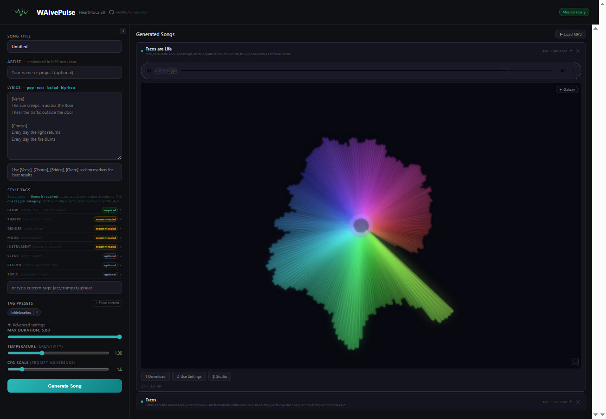
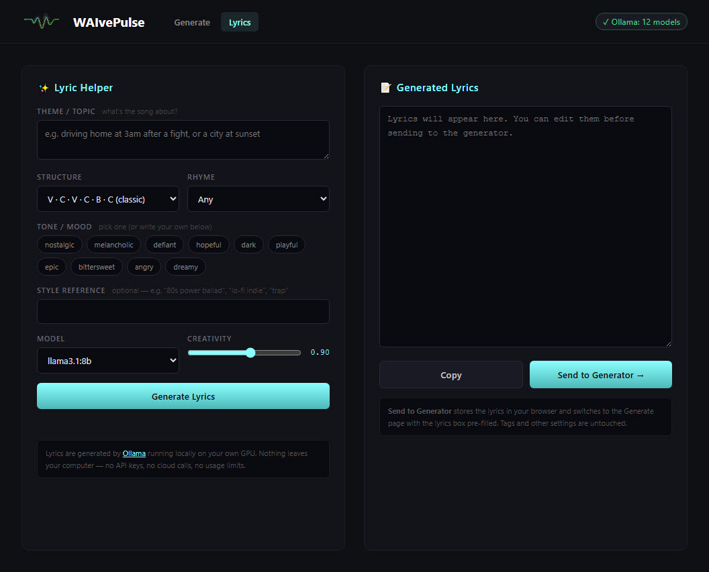
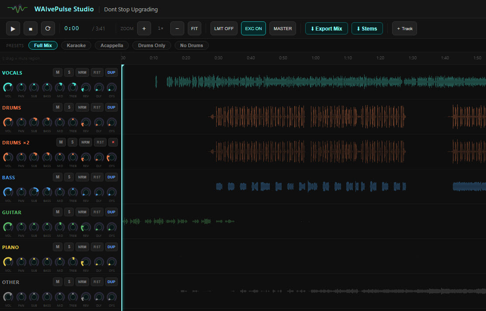
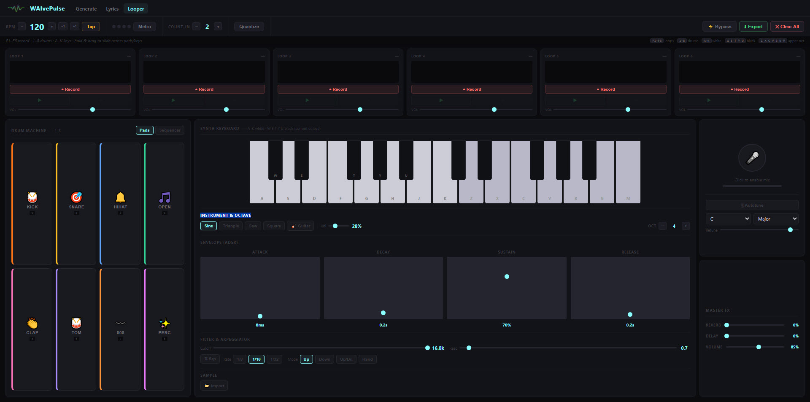
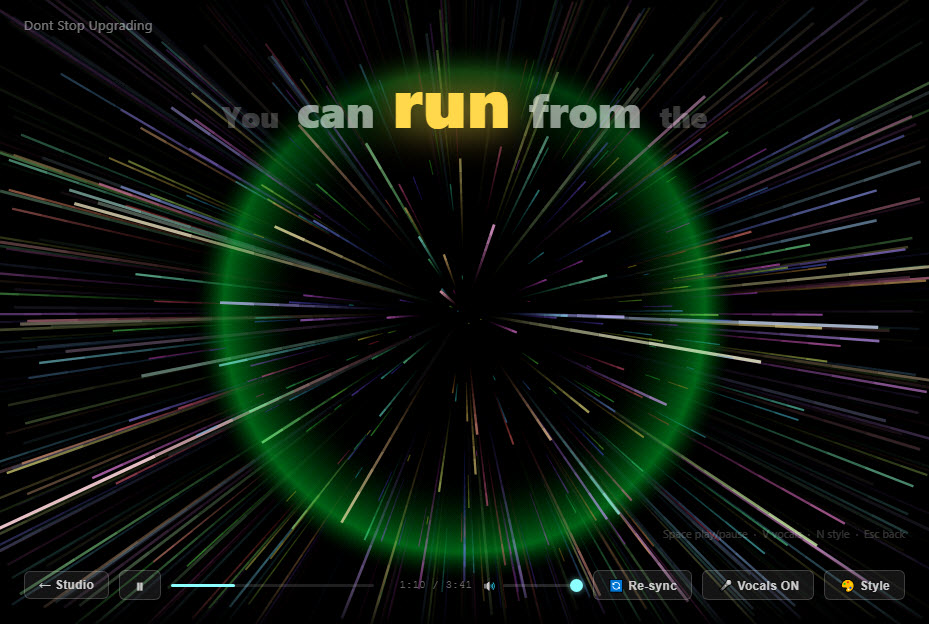

# WAIvePulse


Write a song. Generate it. Mix it. Perform it. On your own GPU.

WAIvePulse is a local AI music studio that runs five connected tools in one browser. You write lyrics (or have Llama write them for you), describe the style you want with tags, and the **HeartMuLa 3B** model generates a complete song with vocals as an MP3. You then open that song in a browser DAW that separates it into six stems, gives you a per-track mixer with mastering chain and Visual EQ, and a karaoke performance mode synced to your original lyrics. A built-in loop station lets you build original ideas layer by layer — drums, keyboard, guitar, microphone — entirely in the browser with no plugins. Mix presets and genre templates save and recall full mixer snapshots, chord detection overlays harmonic analysis on the timeline, a stem library lets you swap stems between songs, side-chain ducking and server-side time-stretch give you production-grade dynamics and tempo matching, MIDI export turns piano-roll patterns into Standard MIDI Files, a vocal harmonizer adds pitch-shifted harmony voices to the mic chain, and the Karaoke page can now record lyric videos directly as WebM — no external screen recorder needed.

No cloud. No subscription. No API keys. No usage caps.



[Watch a song made end-to-end in WAIvePulse](https://www.youtube.com/watch?v=gKttuxGeLkw) (lyric video, generated and mixed in this app).

> **Platform:** Windows 10/11 or Linux. macOS has no NVIDIA CUDA support, so HeartMuLa cannot run there.

---

## The workflow

Five pages, one ecosystem. Each page does one job. The top navigation bar links them all.

### 1. Write lyrics with Ollama



Open the Lyrics page. Pick a theme, song structure, tone, and optional rhyme scheme. Llama 3.1 (running locally via [Ollama](https://ollama.com)) streams lyrics into the output box word by word, pre-formatted with the `[Verse]`/`[Chorus]` markers HeartMuLa requires. Click "Send to Generator" and you land on the Generate page with the lyrics already filled in.

- Live token streaming, so you watch the song form in real time and can abort early if it goes wrong
- Auto-detects Ollama. If it's missing, the page shows an install card with the winget command, the Linux curl one-liner, and a download link
- Passes `keep_alive: 0` so the lyric model unloads from VRAM the moment generation ends. Lyrics, then generate, on a 12 GB card with no contention
- Pulsing dot, shimmering button, indeterminate progress bar, and glowing output panel so the UI stays alive during the 1 to 3 second model-load wait before the first token
- **Edit and polish:** the lyrics box is fully editable. A gutter shows syllables per line, each section's average, and ⚠ on lines that break the section's flow
- **Rhyme scheme:** coloured A/B/C letters per section (`~` = near rhyme)
- **Rhyme Finder:** double-click any word (or type one) for perfect and near rhymes grouped by syllable count; click one to drop it in
- Rhyme suggestions skip people's names, places, and brands
- **Stats bar:** words, lines, sections, and estimated sung length. All offline, using a bundled 30k-word CMU pronunciation dictionary

[Detail section below](#lyric-helper-in-depth)

### 2. Generate the song with HeartMuLa

The main page. Paste lyrics, pick tags from an organised grid (Genre, Timbre, Mood, Instrument, Region, Scene, Topic), set duration and creativity, click Generate. Jobs queue in order. Each card shows the language-model token-generation phase and the audio-codec decode phase as separate progress bars with live log output.

- Multi-job FIFO queue with per-job cancel
- BPM and key auto-detection on completion (chips like `♩ 128 BPM` and `♬ A minor`)
- Seven audio visualizer styles with fullscreen mode
- ID3 metadata baked into every MP3 with title, artist, tags, temperature, CFG scale
- AudioSeal neural watermark and C2PA provenance manifest embedded when the libs are installed
- Tag presets saved to browser localStorage so your favourite combos stay one click away
- **Seed control:** a Seed field with 🎲 roll and 🔒 lock. The seed is saved on every song (card chip, Details, ID3), so any take can be reproduced
- **Takes 1–4:** queue several takes of the same prompt in one click, labelled "Take 2/3"
- **↺ Reuse** on any card refills the whole form (lyrics, tags, duration, temperature, CFG, seed)
- **Instrumental (experimental):** sends only section markers plus the `instrumental` tag. HeartMuLa has no true instrumental mode
- **Start from a song or a picture:** drop an audio clip (or pick one of your own songs) and the page reads its BPM, key, timbre and CLAP-scored genre / mood / instrument / vocals into suggested tag chips. Drop an image and a local vision model turns the scene into tags and a lyric theme. [Details below](#start-from-a-song-or-a-picture)
- **Render tier:** Quick take / Balanced / Deep / Wild / Custom above the Generate button. Balanced is exactly the old behaviour. Each button shows the seconds it took on this machine. [Details below](#render-tiers)
- **Duration estimate:** "≈ 2:45 for these lyrics · use" under the duration slider
- **✨ Suggest tags:** local Ollama picks tags from the page's own tag list based on your idea or lyrics
- **Library:** search, ★ favorites filter, and sort above the song list
- **Ratings:** 1–5 stars per song, a "Top rated" sort, and a minimum-rating filter
- **🖼 Cover art:** every song gets a designed record sleeve — twelve art directions (Swiss, Brutalist, Risograph, Blue Note, Metal, Neon horizon, Minimal, Pop, Label mono, Letterpress, Bauhaus, Xerox zine) picked from its genre and mood tags, set in vendored open-licence type, with measured 4.5:1 contrast. Pick a style or hit ↻ Regenerate on any card; the MP3's embedded cover updates with it
- **🎬 Video:** turns any song into a 1080p H.264 MP4 for YouTube, with the song's cover art, title, and a waveform strip. The same cover is embedded in new MP3s
- Drop external MP3s onto the history panel to play them, or to send them into Studio for stem separation

[Detail section below](#generate-page-in-depth)

### 3. Mix in Studio



Click the Studio button on any finished song card. Demucs splits the song into six stems (vocals, drums, bass, guitar, piano, other) on your GPU, then drops you into a DAW-style mixer with waveform display, per-track knobs, A-B loop, mute automation, ripple cut, track import, and a full master bus chain.

- **7-band parametric EQ on every track:** click the EQ button to open a modal with a live spectrum analyzer and a draggable curve — high-pass, low shelf, three bells, high shelf, and low-pass, each with freq/gain/Q, all backed by the actual biquad responses — it's the single per-track EQ (the old quick SUB/BASS/MID/TREB knobs were retired in favour of it)
- **Master soft clipper (CLP) or limiter (LMT)**, mutually exclusive. The clipper preserves transient punch on AI music that otherwise sounds limp; the limiter glues for a louder, ballad-friendly sound
- **Harmonic exciter (EXC):** parallel 3 kHz high-pass into a soft saturator at 18% wet, for air and shimmer AI vocals lack
- **Master FX rack:** a noise gate (with duck mode), a bitcrusher + sample-rate reducer, a 4×-oversampled wavefolder, and a Dattorro plate reverb — each bypassable and baked into Export Mix
- **Master fade in/out:** smoothly ramps the whole mix up at the start and down at the end (0–15 s each) — cleans up the hard stops AI music often has. The fade-out is measured back from the current song end, so it follows a Cut, and it catches the reverb/exciter/plate tails
- **MASTER preset:** one click applies a starter mastering chain (drum ADT thickening, per-stem EQ, exciter, clipper, master sub and air EQ boost)
- **Mute automation:** shift-drag any waveform to draw red mute regions, baked into Export Mix
- **✨ Rewrite Section (ACE-Step):** select a span on the ruler, describe the change in plain words, and a second engine redraws that span, singer, melody and lyrics included. Needs a separate 16 GB install and about 9.5 GB of free VRAM. [Details below](#rewrite-section-ace-step)
- **🎛 Mashup:** pick a source song per stem, and the builder tempo-matches, key-shifts and downbeat-aligns them onto separate tracks. [Details below](#mashup-builder)
- **✂ Sample this:** snap a ruler selection to whole bars and preview it, add it as a track, download a WAV, or send it to the Looper with BPM and scale already set. [Details below](#sample-this)
- **Track import:** drag any audio file onto the page and it becomes a full mixer track with its own knob set and loop toggle
- **Export Mix** renders a lossless WAV with every knob, EQ band, mute region, and master-chain stage baked in. What you hear is what you get
- **Mix presets / genre templates:** save and load full mixer configurations as named presets. Four built-in genre templates (Radio Pop, Lo-Fi Hip Hop, Rock, EDM) plus user-saved presets with one-click recall and delete
- **Chord detection overlay:** backend chroma analysis identifies chords (major/minor across all 12 roots) and displays yellow labels on the timeline between the ruler and the first track, toggleable via the CHORDS button
- **Stem swap between songs:** a stem library modal lists every stem across all completed separations with BPM and key metadata — click any stem to load it as an import track, mixing parts from different songs
- **Side-chain ducking:** an AudioWorklet-based compressor where one track (key, default drums) ducks another (target, default bass) with threshold, ratio, attack, and release controls
- **BPM/key display:** the audio info bar now shows detected BPM and musical key alongside sample rate and channel count (e.g. "44.1 kHz · stereo · 120 BPM · C major")
- **Time-stretch:** server-side phase-vocoder stretching (pitch-preserved) on any stem or imported track, with auto-BPM detection on drag-and-drop import and an auto-stretch prompt when importing stems at a different tempo
- **Section variation + splice:** "Variation" opens the Generate page pre-filled with the same lyrics and tags at a bumped temperature for a fresh take; "Splice" replaces audio in a ruler-selected region with audio from a file, crossfaded at boundaries, with full undo support
- **Loudness-ready exports:** Export Mix can hit a streaming target — YouTube/Spotify −14 LUFS, Apple −16, or Loud −9. It measures the mix to ITU-R BS.1770-4, applies gain, and a look-ahead limiter holds true peak at or below −1 dBTP. The result shows next to the button (e.g. "−14.0 LUFS · −1.2 dBTP")
- **WAV or MP3 320:** MP3 is encoded in the browser (bundled lamejs), fully offline
- **LUFS metering:** a live momentary + short-term LUFS meter in the Master FX bar; **MEASURE** reports integrated loudness and true peak without exporting
- **🎚 Match master:** pick any reference song. The mix is matched to its tonal balance, stereo width, and loudness, with peaks capped at −1 dBTP. Shows before/after LUFS
- **Automation lanes:** the "A" button on a track opens a lane to draw volume or pan changes. Baked into every export and shifted correctly by Cut
- **Song markers → YouTube chapters:** mark Intro/Verse/Chorus on the ruler (Shift+M), then copy a chapter list that follows YouTube's rules
- **Key change:** shift one track or the whole song ±12 semitones, tempo unchanged
- **Project files (.wpproj):** save and reopen the whole session. Edited audio is packed inside; separated stems are linked
- **Spectrogram:** see a track's frequencies over time

External songs work too. Drop an MP3 into the history panel, click Studio, and Demucs runs on it the same way. The full Studio feature set is available on imports.

[Detail section below](#studio-in-depth)

### 4. Build loops in the Looper



Open the Looper page at any time — it works independently of the AI generation workflow. Record up to six layered loops directly in the browser using synthesized drums, a two-octave keyboard synth, a guitar voice, or your microphone. Overdubs are **quantized**: layers always record a full bar aligned to the beat, no matter when you hit Record.

- **Drum machine:** 8 pads (Kick, Snare, Hi-Hat, Open HH, Clap, Tom, 808, Perc) synthesized via Web Audio — keys `1`–`8` — plus a **16-step sequencer** with per-step velocity, **10 premade beat presets** (Four-Floor, Boom Bap, Trap, Rock, Funk, House, Breakbeat, Half-Time, Bossa, Reggaeton) you can load and tweak, **saveable favorites**, and a **→ Loop** button that renders a beat straight into a slot with perfect timing
- **Synth keyboard:** two octaves (C4–C6, keys `A`–`K` / `W E T Y U` / `Z X C V B N M`). Oscillator waveforms, a plucked **guitar** voice, a resonant **low-pass filter** (cutoff + reso), and an **arpeggiator** (rate + up/down/random)
- **Polyphonic piano roll:** a Keys/Roll toggle swaps the keyboard for a chord-capable step sequencer that renders straight to a loop in perfect time, sharing one transport grid with the drum sequencer. Fill adjacent cells to make **held notes** (16th → whole), and watch them appear on a **live grand-staff notation panel** with real durations and contour-slanted beams. **Melody/chord presets** (pop I–V–vi–IV, 50s, 6-4-1-5, jazz ii7–V7–I progressions, arp/scale/pentatonic/bass riffs, plus classical homages — a Bach Prelude arpeggio and a Mozart Alberti bass) plus **saveable favorites** sit under the roll
- **Click-and-drag slide:** hold the mouse and drag across pads or keys for a glissando / drum-roll effect
- **Full ADSR envelope:** Attack, Decay, Sustain, and Release shape every synth voice (vertical sliders)
- **Sampler:** import any audio file (or a recorded loop) and pitch it chromatically across the keyboard
- **Microphone + Autotune:** live input with a clip-guard compressor, plus a stylized hard-tune that snaps your voice to a chosen key/scale
- **Per-loop 7-band parametric EQ:** click ⚌ EQ on any loop for a spectrum + draggable curve (HPF · shelves · bells · LPF), baked into the export
- **Recording feedback:** a blinking count-in, a sweep bar, and a beat-pulsing border show you the timing as you play in
- **Tempo tools:** BPM, tap tempo, metronome, adjustable count-in, quantize, and a per-loop ½-beat nudge
- **Space — real rooms with front-to-back depth:** convolution with *recorded* impulse responses of actual places (small room, live room, studio chamber, concert hall, cathedral, steel plate, spring tank, amp cab — bundled in `assets/ir/`, 828 KiB, all MIT). Internally there are exactly **three** shared convolution busses — close, tree and far mic positions on the same room — so a voice is *placed* rather than reverberated: each loop slot picks a seat (**near / mid / far**) and gets its own pre-delay (~1 ms per 34 cm), air-absorption low-pass, dry level drop and wet/dry ratio. A **Depth** slider scales the whole stage from flat to 12 m deep. Three convolvers no matter how many voices play
- **Master FX:** delay (tempo-synced) and master volume
- **F1–F6** record loops hands-free (each card shows its key); **Export Mix** renders all loops to a single WAV
- **MIDI export:** a "MIDI" button next to Export renders the piano roll and drum pattern as a Standard MIDI File (.mid) — SMF Format 1, 480 PPQN, melody track + drum track on channel 9 with GM percussion mapping
- **Vocal harmonizer:** an AudioWorklet adds pitch-shifted harmony voices to the mic input — two configurable voices (default +4 and +7 semitones, major 3rd and perfect 5th) with per-voice volume and semitone controls, wired after autotune in the mic chain
- **MIDI input:** plug in any USB/Bluetooth MIDI keyboard or pad controller (Chrome/Edge). Velocity, sustain pedal, hot-plug. Channel 10 or "MIDI → Drums" plays the pads. Recorded like any other input
- **Air Band (webcam):** play the drums and keys with your hands in the air. The camera view is split into zones (Drum kit, Keys, Band, Chord tones, or your own Custom mix); a downward strike hits a drum, an open hand held in a zone sustains a note. Hand tracking (MediaPipe) runs on your GPU in the browser, nothing is uploaded. Same input path as keys/MIDI, so it is recorded into loops and follows scale lock, ADSR, filter and arp. ⛶ Big view for recording clips. **Setup:** turn on the browser's graphics acceleration first (Chrome: `chrome://settings/system` → "Use graphics acceleration when available" → Relaunch), otherwise tracking crawls at ~5 fps; with it on, expect ~60 fps
- **Swing & Humanize:** one groove for the drum sequencer and piano roll (0% straight → 100% triplet feel), baked into → Loop renders and MIDI export
- **Probability & ratchets:** per-step 100/75/50/25% chance and 1–4 hit rolls (Prob/Ratchet mode, or Alt/Shift-click), saved with favorites
- **Euclidean fill:** "E" on any drum row spreads N hits evenly, with rotation
- **Scale lock & transpose:** 7 scales; keys, piano roll, arpeggiator and MIDI snap into key; shift the whole roll ±12 semitones
- **Project files (.wploop):** every loop, pattern, bank, synth setting, FX, and song arrangement in one file (Ctrl+S; drag-drop to open). Warns before you lose unsaved work
- **MIDI file import:** channel 10 fills the drum grid, other channels fill the piano roll; tempo is offered; multi-bar files spread across banks
- **Better export:** WAV or MP3 320, with a loudness target (−14/−16/−9 LUFS, ≤ −1 dBTP) and a readout. The Song Builder has the same options
- **Ensemble voices:** every note can be played by up to 7 sub-voices, each detuned a few cents, placed across the stereo field, entering up to 30 ms apart, and drifting slowly in pitch. That is the difference between one synth and a section. Size 1 sounds exactly like it always did
- **Expression lane:** the dynamics curve under the piano roll. Draw it freehand, shift-drag a straight line, or drop a swell, fall, arch or pulse. It feeds the ensemble twice per step across a note's whole length, so a held note *moves*: louder comes out brighter and wider, the way a player blowing harder does. Saved with the project and exported as MIDI CC1
- **Real rooms:** eight impulse responses (small room, live room, studio chamber, concert hall, the Pantheon, plate, spring, cab) through three shared convolution busses standing in for close, mid and far microphones. Put a loop at the back and it arrives later, darker and wetter — front-to-back depth instead of one flat reverb
- **Pattern banks A–D + chain:** four drum+roll patterns, switched on the next bar, chained like "A A B A C"; → Loop and MIDI export render the whole chain

[Detail section below](#looper-in-depth)

### 5. Perform in Karaoke



After separation, click the Karaoke button. faster-whisper transcribes the vocals stem on demand, an LCS algorithm aligns the transcript to your original lyrics (correcting misheard words), and a fullscreen performance page opens with a five-word sliding lyric window, 20+ visualizer styles, and your Studio mix carried over intact.

You can also record lyric videos directly from the browser — no external screen recorder needed. A built-in recorder captures the canvas visuals and the full audio mix as a WebM file (VP9 + Opus). Press the record button (or `R`), playback starts from the beginning, lyrics render onto the video frame via a five-word sliding window, and when the song ends the recording auto-stops and downloads. For manual capture, OBS, Windows Game Bar, NVIDIA ShadowPlay, and QuickTime still work as before.

[Detail section below](#karaoke-in-depth)

---

## Why WAIvePulse

| | WAIvePulse | Cloud song generators (Suno, Udio) | Pro DAWs (Logic, Ableton) |
|---|---|---|---|
| Runs offline | Yes | No | Yes |
| Open source | Yes | No | No |
| Generates songs from lyrics | Yes | Yes | No |
| Browser-based stem mixer | Yes | No (or extra fee) | N/A (native) |
| Karaoke or lyric video output | Yes (built-in WebM recorder) | No | No (manual) |
| Chord detection overlay | Yes (librosa chroma analysis) | No | Plugin or manual |
| MIDI export from sequencer | Yes (SMF Format 1) | No | Native |
| Side-chain ducking | Yes (AudioWorklet) | No | Native or plugin |
| Stem swap between songs | Yes (built-in library) | No | Manual import |
| Time-stretch (pitch-preserved) | Yes (server-side phase vocoder) | No | Native or plugin |
| Export at YouTube loudness (−14 LUFS) | Yes (BS.1770 meter + limiter) | No | Plugin |
| Reference-track mastering | Yes | No | Plugin |
| YouTube video + captions | Yes (MP4, SRT/VTT/LRC) | No | No |
| MIDI keyboard input | Yes (Web MIDI) | No | Native |
| Loop station (drums, synth, guitar, mic) | Yes | No | External plugin |
| Subscription | None | Monthly | Monthly or one-time |
| Usage cap | None | Tokens or credits | None |
| Your lyrics or audio leave your computer | Never | Always | Never |

For a solo producer with a 12 GB+ NVIDIA GPU, the trade is a one-time install plus a 21 GB model download in exchange for permanent freedom from cloud lock-in.

---

## System requirements

| Component | Requirement |
|---|---|
| OS | Windows 10/11 or Linux |
| GPU | NVIDIA with ~12 GB VRAM (CUDA required) |
| Python | 3.10+ |
| Disk | ~25 GB (HeartMuLa + HeartCodec weights) plus working space |
| Optional | `librosa` (BPM and key chips), `audioseal` + `c2pa` + `cryptography` (watermarking), `faster-whisper` (Karaoke lyric sync), `demucs` (Studio stem separation), `ffmpeg` (MP3 stem output), Ollama (lyric writing), [ComfyUI](https://github.com/comfyanonymous/ComfyUI) + any SDXL checkpoint (~7 GB) for [AI cover art](#ai-cover-art-optional-local) — the 12 designed sleeves need none of it |

`setup.sh`/`setup.bat` installs the required Python packages and downloads the model weights. You do not need to install any of these by hand.

---

## Quick start

### First-time setup (run once)

**Windows:**

```batch
setup.bat
```

**Linux:**

```bash
bash setup.sh
```

The script installs Python, ffmpeg, and git if missing; checks your NVIDIA and CUDA versions; creates a Python virtual environment; installs PyTorch with the right CUDA build, heartlib, and dependencies; then downloads the HeartMuLa weights (~21 GB).

The default install location is `~/HeartMuLa/` (Linux) or `%USERPROFILE%\HeartMuLa\` (Windows). To install somewhere else, set `WAIVEPULSE_VENV` and `WAIVEPULSE_CKPT` before running setup.

### Launch (every time)

**Windows:**

```batch
start.bat
```

**Linux:**

```bash
bash start.sh
```

Open **http://localhost:7861** in any browser. The launcher kills any old server process on port 7861 before starting.

---

## Reference

What follows documents each page in detail, plus the file structure, API surface, technical implementation, configuration, and troubleshooting. Skip to the section you need.

---

## Generate page (in depth)

### Song title

Optional label. Used as the filename and the display name in the history panel.

### Artist

Optional. Embedded into the MP3 as the ID3 Artist tag. Leave blank and it defaults to `WAIvePulse`.

### Lyrics

HeartMuLa was trained on lyrics with section markers, and it produces better songs when you use them. Supported markers:

```
[Intro]
[Verse]
[Prechorus]
[Chorus]
[Bridge]
[Outro]
```

Minimal working example:

```
[Verse]
The city lights shine bright tonight
I walk alone beneath the open sky

[Chorus]
Feel the rhythm, feel the beat
Dancing through the crowded street
```

Use the template links (pop, rock, ballad, hip-hop) above the lyrics box to load a full example you can edit.

### Tags

Tags tell HeartMuLa what the song should sound like. HeartMuLa was trained with eight tag categories, each shaping a different dimension of the output. The UI groups them in collapsible sections so you pick deliberately.

**The rule that matters most: one tag per category.** The model was trained on examples where each category had a single value. Stacking multiple tags in one category (e.g. `pop,rock,jazz`) averages them into something muddier than any one would produce alone.

| Category | Importance | What it shapes |
|---|---|---|
| Genre | Required | The core musical style. Always pick one. |
| Timbre | Recommended | Tone and texture. Bright vs dark, warm vs harsh, smooth vs gritty. |
| Gender | Recommended | Vocalist sounds male, female, or mixed. Also `no vocals` for instrumentals. |
| Mood | Recommended | Emotional colour. Nostalgic, epic, melancholic, playful, etc. |
| Instrument | Recommended | A featured instrument the model will try to push to the front. |
| Scene | Optional | A setting that shapes atmosphere. Coffee shop, stadium, late night. |
| Region | Optional | Cultural flavour. `british` pulls toward melodic rock, `latin` adds rhythmic warmth. |
| Topic | Optional | Lyrical subject. Reinforces what you wrote in the lyrics box. |

A clean combo: `rock,dark,male vocals,nostalgic,electric guitar,british`. One per category, covers the most influential dimensions.

Avoid: `pop,rock,jazz` (three Genre tags) or `happy,melancholic,dark` (conflicting Mood tags).

Blending two artists: the model doesn't know artist names, so describe what makes each distinctive across different categories. To blend Linkin Park and The Beatles, try Genre `rock`, Timbre `dark`, Region `british` (the key Beatles lever), Mood `nostalgic`, Instrument `electric guitar`. Each tag pulls from a separate category, so they reinforce each other instead of fighting.

Type freeform tags in the custom field below the grid (comma-separated) for sub-genre descriptors like `nu-metal`, `anthemic`, or `chamber pop`.

### Tag presets

Click "+ Save current" next to "Tag Presets" to save your active tag selection under a name. Saved presets appear as chips. Click a chip to apply it, click × to delete it. Presets live in browser localStorage and persist across sessions.

### Advanced settings

| Setting | Default | Range | Description |
|---|---|---|---|
| Max Duration | 5:00 | 0:30 to 5:00 | Upper limit on song length. The model may stop earlier at a natural end. |
| Temperature | 1.0 | 0.5 to 2.0 | Higher = more creative and unpredictable. Lower = more conservative and structured. |
| CFG Scale | 1.5 | 1.0 to 5.0 | How strictly the output follows your tags. Higher = stronger style adherence. |

### Generate

Click "Generate Song". The button re-enables right away so you can queue another request. The worker runs one job at a time; the rest wait.

Each job card shows two progress bars during generation:

- **Language model**: token generation (phase 1)
- **Audio codec**: waveform decode (phase 2)

Plus a live log scrolling raw output from the model. Amber pulsing dot = generating, green dot = done.

### Completed cards

Each finished card has an audio player with seven visualizer styles (click the style button to cycle, or double-click the visualizer to go fullscreen), plus:

- **Download:** save the MP3 to disk
- **Use Settings:** load this song's lyrics, tags, and artist back into the form for a re-roll
- **Studio:** open the stem-separation Studio for this song
- **Karaoke:** open the karaoke performance page once separation has finished
- **Cancel:** for queued or generating jobs only
- Duration, file size, BPM, and key chips

Visualizer styles:

| Style | Description |
|---|---|
| Ring | Circular frequency bars around a glowing core |
| Bars | Vertical frequency spectrum with glow |
| Wave | Mirrored waveform fill |
| Galaxy | Rotating starburst, lines radiate from centre coloured by frequency |
| Aurora | Layered flowing sine bands, like northern lights |
| Particles | Frequency-reactive particles that scatter outward and drift with gravity |
| Scope | Stabilised oscilloscope with zero-crossing lock |

Double-click any visualizer (or click the fullscreen icon) to launch it fullscreen, good for a TV or second screen. Move the mouse to reveal style-cycle and exit controls. Press Escape to leave.

ID3 metadata embedded in every generated MP3:

| Tag | Value |
|---|---|
| Title | Song title |
| Artist | Your input, or "WAIvePulse" if blank |
| Album Artist | WAIvePulse |
| Composer | HeartMuLa 3B |
| Genre | Full tags string |
| Year | Current year |
| Encoded by | WAIvePulse / HeartMuLa 3B |
| Comment | `Tags: ... | Temperature: ... | CFG Scale: ...` |

### Load MP3 (external songs)

Click the "Load MP3" button to import local audio files into the history panel. Drag and drop also works for MP3, WAV, FLAC, OGG, M4A onto the right-hand panel.

Loaded files play and visualize in the browser. Click the Studio button on a loaded card and the file is uploaded server-side (via `POST /upload`) and Demucs runs on it the same way as a generated song. The full Studio feature set works on imports: stem mixer, mute regions, Visual EQ, MASTER preset, master bus chain, Export Mix, Karaoke.

One caveat. If you bookmark a Studio URL for a loaded MP3 and reopen it in a fresh browser session, the in-memory file reference is gone. Go back to the main page, drop the MP3 again, and click Studio. Songs generated by WAIvePulse and songs imported via the upload flow live server-side and never hit this limit.

### Generation time

Approximate times on a mid-range 12 GB GPU. Your hardware will vary.

| Duration | LM Tokens | Approx. time |
|---|---|---|
| 30 seconds | ~375 tokens | 10 to 12 min |
| 1 minute | ~750 tokens | 20 to 25 min |
| 2 minutes | ~1500 tokens | 40 to 50 min |
| 3 minutes | ~2250 tokens | 60 to 80 min |
| 5 minutes | ~3750 tokens | 100 to 130 min |

Two phases run sequentially:

1. Language model phase, autoregressive audio token generation, ~1.5 tokens/sec
2. Codec decode phase, audio tokens to waveform, ~41 sec/step, ~10 steps per ~30s of audio

Both phases stream live in the browser via the job card.

### Start from a song or a picture

The **Start from** card above the tag grid has two buttons, **♪ Sounds like this** and **▣ From a picture**, a drop zone, and a dropdown to use one of your own finished songs instead of uploading.

**From a clip.** BPM and key come from the same librosa code the song cards use. Genre, mood, instrument and vocal gender are scored by CLAP (`laion/clap-htsat-fused`, Apache-2.0) against the Generate page's own tag list only. Timbre and density come from plain spectral analysis. Scene, Region and Topic are never guessed. Results appear as chips with a confidence percentage. Nothing is applied until you click a chip or **Apply N tags**; one tag per category, so a chip replaces whatever was in that slot.

Trust the results in this order: BPM, key and timbre are measured and solid. CLAP is weak: on this machine it matched a song's original genre 1 time in 17, mood 1 in 15, instrument 1 in 10. Treat those chips as a starting point.

**From a picture.** `qwen3-vl:4b` (through Ollama) describes the scene, then `llama3.1:8b` turns the description into tags plus a lyric theme. **Copy lyric theme** puts the theme on the clipboard for the Lyric Helper. If `qwen3-vl:4b` is missing it falls back to any other installed vision model.

Requirements and limits:

- CLAP downloads once (about 618 MB into the Hugging Face cache) and needs the `transformers` package, which is not in `requirements.txt`: `pip install transformers`. The page asks before downloading.
- The vision model is about 3.3 GB through Ollama and needs `ollama serve` running. The page asks before pulling it.
- Upload limits: 80 MB audio, 20 MB image.
- Analysis refuses while HeartMuLa holds the GPU; it needs about 4 GB free. Run it before you queue songs.
- If CLAP cannot load, you still get BPM, key and timbre, with a "CLAP was unavailable" note.

### Render tiers

The Render tier control sits above the Generate button. Pick one and the Temperature and CFG sliders in Advanced settings mirror it, so what the model receives is always visible. Moving either slider by hand switches to **Custom**, and the server then applies nothing of its own.

| Tier | What changes | Mean (8 s clip) | Spread | Runs | vs Balanced |
|---|---|---|---|---|---|
| Quick take | CFG 1.0 (language model runs batch 1 instead of 2), 5 vocoder steps, no vocoder guidance | 248 s | 248–249 s | 2 | 0.42x |
| Balanced | The old defaults, untouched: temp 1.0, CFG 1.5, top-k 50, 10 vocoder steps at 1.25 | 592 s | 491–630 s | 4 | 1.00x |
| Deep | temp 0.95, CFG 2.0, 25 vocoder steps at 1.6 | 1396 s | 1085–1708 s | 2 | 2.36x |
| Wild | temp 1.35, CFG 1.15, top-k 150; vocoder as Balanced | 485 s | single run | 1 | 0.82x |

**One render is not a repeatable benchmark on this machine, so read the spread, not just the mean.** All clips are 8 seconds, same seed, same lyrics and tags, on an RTX 3060 12 GB. Balanced was measured four times and ranged 491 to 630 s for byte-identical audio. The variance is not Ollama: the slowest Balanced run had the card to itself, and the run with a 5 GB model resident came in faster. It is memory pressure, and Deep shows it worst — its two runs are 623 s apart, and in the slower one the language-model phase alone took 226 s against 61 to 84 s everywhere else, with 128 MB of VRAM left.

Two numbers are more trustworthy than the absolute seconds:

- **Within one process, timing is near-exact.** Two Balanced renders in a single process landed 630.2 s and 630.1 s.
- **Same-session ratios are tighter than mean-over-mean.** Measuring a tier and a Balanced run back to back gives Quick 0.45x, Wild 0.99x and Deep 1.76x, against the 0.42x / 0.82x / 2.36x in the table. Both are published, as `vs_balanced` and `vs_balanced_same_session`.

The vocoder is 76 to 90% of every render, which is why `num_steps` is the knob that moves the clock: 188 s at 5 steps, 421 to 532 s at 10, and 1019 to 1481 s at 25. That is 38 to 59 s per step depending on memory pressure. The reason is that the HeartMuLa language model (about 7.5 GB in bf16) and the HeartCodec vocoder (6.2 GB in fp32) are loaded together, which is more than a 12 GB card holds; Windows lets CUDA spill into shared system memory, so a render runs with about 11.5 GB on the card and 14 GB more in system RAM, paging over PCIe. That is also why the machine feels slow while a song generates.

To reproduce: unload Ollama first (`POST 127.0.0.1:11434/api/generate` with `{"model":"<name>","keep_alive":0}`), then render the same lyrics at a locked seed several times per tier and keep the spread. The numbers live in `backend/analyze.py` (`TIERS[...]["measured"]`) and the UI reads them from `/vibe/status`.

Audio quality is deterministic **within** a session but not across them: the same locked seed produced different audio in a different process, so the loudness, flatness, stereo-width and word-count proxies in `measured` rank the tiers only as measured in one pass. They are not a cross-machine promise.

Quick take used to fail with a shape error if it ran after any other tier in the same server session. Fixed: the tier hook now drops key-value caches built for the previous batch size before each render. The fix restores state rather than just dodging the crash — a Balanced render before and after an intervening Quick render produced bit-identical audio on every metric.

### Cover art

Every song gets a designed record sleeve, not a procedural smear. `backend/cover.py`
holds twelve hand-authored art directions; the song picks one deterministically from
its job id plus its tags, steered by genre and mood, so a doom track lands on the
metal sleeve and a bebop track lands on the Blue Note one.

| Direction | What it is |
|---|---|
| Swiss grid | Huge flush-left Archivo, hard grid, hairline rules, one accent shape, lots of white space |
| Brutalist | Stark black/white plus one signal colour, condensed caps scaled edge to edge, heavy rules, one knocked-out bar |
| Risograph | Cream stock, two spot inks printed out of register, halftone screens, paper fibre, solid ink title |
| Blue Note | Duotone halftone block, offset colour bar, tight Oswald caps, cream ground |
| Metal | Deep blacks, a heavy centred emblem, blackletter (or a 900-weight Fraunces when the title is long), press distress |
| Neon horizon | Two hues only: slit sun or ridgeline, perspective grid, hard offset print on the type, scanlines. No rainbow mush |
| Minimal | One geometric form, muted two-tone palette, tiny letterspaced Space Grotesk, a lot of air |
| Pop cut-out | Bold colour field, hard-edged cut-outs, oversized Syne / Archivo Black, a sticker for the artist |
| Label mono | All JetBrains Mono: a seeded data matrix, technical rules, registration crosses, catalogue number |
| Letterpress | Warm stock, printer's ornaments, DM Serif / Fraunces / Playfair centred, ink pressed into the sheet |
| Bauhaus | Primary geometry on a strict grid, condensed 900-weight caps, sometimes set vertically |
| Xerox zine | 1-bit Floyd-Steinberg dither, toner streaks, skewed page, title knocked out of solid black bars |

**Typography is the design.** The faces are vendored under `assets/fonts` (Archivo,
Archivo Black, Anton, Bebas Neue, Big Shoulders, Oswald, Space Grotesk, JetBrains
Mono, Courier Prime, Instrument Serif, Playfair Display, DM Serif Display, Fraunces,
Syne, UnifrakturMaguntia). Every one is SIL Open Font License 1.1 — see
[`assets/fonts/LICENSES.md`](assets/fonts/LICENSES.md) for the per-family copyright
line and the upstream link, with the full licence text in the `OFL-*.txt` beside it.
Variable axes (weight, width, optical size) are set per direction, tracking is real
per-character letter-spacing, and blocks are aligned by their ink bbox rather than by
font metrics.

Two rules are enforced in code, not left to luck:

- **Fit.** Titles wrap on word boundaries, are balanced with a min-max-width DP,
  shrink to fit a fixed box, cap at three lines and ellipsise beyond. A single word
  wider than the box is hyphen-broken only as a last resort, never before shrinking.
  Characters no vendored face can draw (emoji, astral plane) are dropped, and a face
  that cannot cover the title (blackletter for Cyrillic, say) falls back automatically.
- **Contrast.** Before each piece of type lands, its glyph mask is rendered and the
  pixels actually behind it are read; if the WCAG ratio falls under 4.5:1 a solid
  plate or knockout is drawn — never a blur, never a soft drop shadow.
  `tests/test_cover.py` asserts the whole audit for every direction at both 1200 px
  and 300 px.

### Choosing a cover

- **Generate page → Advanced settings → Cover art.** Auto (tag-steered) or any
  direction by name. The choice is remembered in the browser and applied to
  everything you generate from then on.
- **Any finished song card** shows its cover with the same picker plus
  **↻ Regenerate cover**, which rolls a fresh seed: same rules, a different sleeve.
  Changing the style or regenerating rewrites the MP3's ID3 APIC frame straight away,
  so the file on disk always matches what you see.
- A song's direction is pinned into `history.json` when its cover is first made, so
  editing tags later never changes a sleeve you have already shipped.

### Optional AI art layer

Picking **AI art layer** paints a picture with Stable Diffusion XL on your own GPU
and uses it *underneath* the typography — the layout and type still carry the sleeve.
It is opt-in, never on the default path, and if ComfyUI is missing, switched off or
slow the covers render exactly as before. When it is unavailable the menu option is
disabled and its tooltip says why.

To turn it on, click **Set up AI covers** under the Cover art picker: the panel finds
ComfyUI and your checkpoints by itself, lets you pick one, and has a **Test** button
that paints a real image and reports the seconds. No config file to edit.
Full detail, including what to install: [AI cover art](#ai-cover-art-optional-local).


---

## Lyric Helper (in depth)


Open `/lyrics` or click "Lyrics" in the top nav. Generation runs entirely on your local GPU via Ollama. No API keys, no cloud calls, no usage limits.

### Lyric Helper features

- Theme/topic input, song-structure dropdown (V-C-V-C-B-C and variants), 10 tone chips, optional rhyme scheme and style reference
- Model picker auto-populates from your installed Ollama models. Defaults to `llama3.1:8b` if available.
- Creativity slider (0.4 to 1.3 temperature)
- Live streaming output. Lyrics appear word by word in the textarea as Ollama generates them. A pulsing dot inside the button, a shimmering button gradient, an indeterminate progress bar, and a glowing output panel run in parallel so the UI stays alive even before the first token arrives.
- Section markers (`[Verse]`, `[Chorus]`, etc.) baked into the system prompt so output matches HeartMuLa's expected format
- "Send to Generator" stores the lyrics in `localStorage` and bounces you to the main page with the lyrics box pre-filled
- The final status line reports elapsed time and token count

### Ollama setup

If Ollama isn't installed or isn't reachable, the page renders an inline install card above the form with three steps:

1. **Install Ollama.** Windows: `winget install Ollama.Ollama`. Linux: `curl -fsSL https://ollama.com/install.sh | sh`. Or download the installer from [ollama.com](https://ollama.com/download).
2. **Pull a lyric model.** `ollama pull llama3.1:8b` (~5 GB, recommended) or `ollama pull llama3.2:3b` (~2 GB, smaller-VRAM fallback).
3. **Refresh the page.** The badge in the top-right turns green when Ollama is detected.

If Ollama is running but no models are installed, the card shrinks to the pull-model step only.

### VRAM contention with HeartMuLa

The Lyric Helper passes `keep_alive: 0` to Ollama on every request, so the model leaves VRAM the moment generation finishes. On a 12 GB card the Lyrics-then-Generate workflow is safe: by the time you click "Generate Song", the ~5 GB Llama allocation is gone and HeartMuLa loads into a clean slate.

If you do hit `CUDA out of memory`, the error message in the job card lists the three common causes (Ollama still loaded, a prior crash leaked memory, another GPU app running).

---

## Studio (in depth)


Click the Studio button on any finished song card. The Studio page runs Demucs (Facebook Research) on the song to separate it into up to six stems, then opens a DAW-style mixer.

### Setup

- `demucs` in your Python environment. Included in `requirements.txt`.
- `ffmpeg` on your PATH for MP3 stem output. Falls back to WAV if missing.
  - Linux: `sudo apt install ffmpeg`
  - Windows: `winget install ffmpeg`
- Separation runs on your GPU and takes a few minutes per song.

### Stems

| Stem | Contents |
|---|---|
| Vocals | Lead and backing vocals |
| Drums | Drum kit and percussion |
| Bass | Bass guitar and low end |
| Guitar | Electric and acoustic guitar |
| Piano | Piano and keys |
| Other | Everything else |

### Stem presets

One-click buttons above the mixer apply common stem combinations:

| Preset | What's audible |
|---|---|
| Full Mix | All stems |
| Karaoke | Everything except vocals (sing along) |
| Acappella | Vocals only |
| Drums Only | Drums only |
| No Drums | Everything except drums |

### Mix presets / genre templates

Save and load full mixer configurations as named presets. A bar below the FX bar holds genre template buttons and user-saved presets.

- **Four built-in genre templates:** Radio Pop, Lo-Fi Hip Hop, Rock, EDM — each applies a curated starting point for that style
- **User presets:** click "Save" to snapshot the current mixer state under a name; click a preset chip to restore it; click × to delete. Stored in `localStorage`, so they persist across sessions
- **What a snapshot captures:** per-stem volume, pan, 7-band EQ, reverb amount, delay amount, and offset, plus the full master chain state — all effect toggles and parameters including gate (with duck mode), bitcrusher, wavefolder, plate reverb, exciter, limiter/clipper, and fade in/out times
- **Restoring a preset** sets every knob, toggles every effect, and syncs the UI to match — the mixer looks and sounds exactly as it did when the snapshot was taken

File: `frontend/js/studio/presets.js`

### A-B loop

Drag on the ruler to mark a loop region. A cyan highlight shows the selected range. Enable the loop button and playback repeats inside that region. ESC clears the loop.

### Mute automation

Draw mute regions on any waveform to silence a track for a specific section. Useful for an acappella refrain, a drum solo, or an instrumental bridge.

- Shift-drag on a waveform draws a red mute region for that track
- Click inside a mute region to delete it
- Regions on the same track auto-merge if they overlap or sit within 50 ms of each other
- Mute regions play live and bake into Export Mix
- Sidebar header reminds you: `⇧ drag = mute region`

### Cut (ripple delete)

Where a mute leaves a silent gap, **Cut** removes a section from *every* track at once and closes the gap, so the whole song gets shorter — for trimming dead air, a long intro, or an unwanted section.

- Select a region by dragging on the ruler (or set the `[` / `]` loop points), then click **✂ Cut**
- It splices that range out of every stem's buffer and ripples everything after it left; imported clips after the cut slide left to stay in time, and clips that straddle the cut are spliced too
- A confirm dialog shows the new total length first; **↩ Uncut** undoes it (multiple levels)
- The shortened timeline is what plays and what gets exported

### Track import

Bring any audio file in as an extra mixer track. A sample, a loop, a scratch vocal, anything.

- "+ Track" button in the transport bar opens a file picker (MP3, WAV, FLAC, OGG, M4A, AAC)
- Drag and drop one or more audio files onto the Studio window. A fullscreen drop target appears.
- Imported tracks appear below the stem tracks with the same full knob set (VOL, PAN, EQ, REV, DLY, OFS)
- Loop toggle on imported tracks repeats a short sample for the full song duration
- × button removes the imported track
- Loop state is respected in Export Mix
- Imported tracks render in gold in the waveform view so they're easy to spot

### Per-track 7-band parametric EQ

Click the EQ button on any track strip to open the parametric EQ modal (the same shared component the Looper uses):

- **Seven bands:** high-pass · low shelf · three bells · high shelf · low-pass, each with configurable frequency, gain, and Q — for surgical correction, tonal shaping, and removing unwanted content
- A live spectrum analyzer tapped after the EQ, plus **per-band coloured fill regions** showing each band's individual contribution
- The combined curve drawn from the actual biquad responses via `getFrequencyResponse()` (no approximations)
- **Drag** a band point for freq + gain; **scroll** over it for Q
- A readout row showing each band's filter-type icon, frequency, dB, and Q; a "RESET EQ" button flattens it
- The **only** per-track EQ — it sits right after the track's pan in the signal chain (`pan → EQ → bus/sends`) and is fully baked into Export Mix. The one-click MASTER mastering preset shapes each stem through these bands, too

Press Escape to close.

### Master bus chain

Signal path on the master bus:

```
                        [Side-chain ducking]
                         key track ──→ envelope
                                        ↓ gain reduction
Track sends -> Master Bus -> Sub EQ (60 Hz lowshelf) -> Air EQ (10 kHz highshelf)
            -> [Gate] -> [Crusher] -> [Wavefolder] -> FX Out -> [LMT or CLP] -> Master Volume -> Output
                                                            |-> Exciter (parallel) ------------------^
                                                            \-> Plate reverb (parallel send) --------^
```

The gate, crusher, wavefolder, and side-chain ducker are serial inserts (off by default, bypassed when off); the exciter and plate reverb are parallel sends. Side-chain ducking operates per-track before the master bus (the key track's envelope controls gain on the target track). All of them, plus the limiter/clipper, are reproduced exactly in Export Mix.

**LMT vs CLP, pick one.** They sit at the same point and target the same problem (peaks) with different methods.

| | LMT (Limiter) | CLP (Clipper) |
|---|---|---|
| Method | DynamicsCompressor, −18 dB threshold, 4:1 ratio, fast attack | tanh-bent waveshaper, knee ≈−4.4 dBFS, ceiling −0.5 dBFS, 4× oversampled |
| Effect on transients | Ducks them. Envelope follower clamps gain when input exceeds threshold | Bends them at the ceiling. Instant, sample-by-sample |
| Sound | Glued, radio-ready, can feel squashed | Punchy, transients survive, can add mild harmonic distortion if pushed |
| Best for | Vocal-forward mixes, ballads, anything where average loudness matters more than transient detail | Drum-forward mixes, anything where kick and snare snap matter. AI-generated music that feels limp. |
| Use when | You want loudness glue and don't mind softer drums | You want loudness without losing impact (a sensible default for AI music) |

Clicking either button automatically disables the other.

### Controls

A blank Hotkey cell means the control is mouse-only.

| Group | Control / action | Hotkey | What it does |
|---|---|---|---|
| Transport | Play / pause | `Space` | Toggle playback |
| Transport | Stop | `Home` | Stop and return to start |
| Transport | Jump to end of song | `.` | Seek to the end |
| Transport | Nudge playhead | `←` / `→` | Seek back / forward 2 seconds |
| Transport | Jump playhead | `Shift+←` / `Shift+→` | Seek back / forward 10 seconds |
| Transport | Click anywhere on a waveform or ruler | | Seek to that position |
| Track select | Click a track strip or waveform row | | Selects that track (cyan highlight) |
| Track select | Cycle next / previous track | `Tab` / `Shift+Tab` | Selection follows highlight |
| Track ops | Mute | `M` or click `M` button | Silence selected track |
| Track ops | Solo | `S` or click `S` button | Hear only soloed tracks (multiple solos OK) |
| Track ops | Normalize | `N` or click `NRM` | Bring peak to ~−0.5 dBFS |
| Track ops | Reset all knobs on track | `R` or click `RST` | Per-track reset to defaults |
| Track ops | Duplicate track | `D` or click `DUP` | Independent copy with its own knobs (use OFS for ADT) |
| Track ops | Parametric EQ | click `EQ` | Live spectrum + draggable 7-band parametric curve (HPF · shelves · bells · LPF) |
| Knobs | Drag VOL / PAN / SUB / Bass / Mid / Treb / Rev / Dly / OFS | | Drag up-down or scroll wheel |
| Knobs | Reset a single knob | double-click knob | Back to default value |
| A-B loop | Drag on the ruler | | Mark a loop region (cyan highlight) |
| A-B loop | Set loop IN at playhead | `[` | Marks the loop start |
| A-B loop | Set loop OUT at playhead | `]` | Marks the loop end |
| A-B loop | Toggle loop | `L` or click loop button | Repeat playback inside the marked region |
| A-B loop | Clear loop region | `Esc` | Removes the marked region |
| Mute regions | Paint mute region on a track | `Shift` + drag on waveform | Draws a red mute region for that track |
| Mute regions | Delete one region | click inside the region | Removes that region |
| Mute regions | Clear all on selected track | `Delete` / `Backspace` | Wipes every mute region on the track |
| Track import | Drag clip block left / right | | Reposition the imported clip on the timeline |
| Track import | Toggle loop on imported track | click loop icon | Short sample repeats for full song |
| Track import | Remove imported track | click × on the strip | Drops the import |
| Master bus | Harmonic exciter | click `EXC` | Parallel 3 kHz saturation at 18% wet |
| Master bus | Limiter | click `LMT` | Master limiter (turning on disables CLP) |
| Master bus | Soft clipper | click `CLP` | Master clipper at −0.5 dBFS (turning on disables LMT) |
| Master FX | Noise gate | click `GATE` | Dual-threshold hysteresis gate, attack/hold/release; `DUCK` inverts it |
| Master FX | Bitcrusher | click `CRUSH` | Bit-depth + sample-rate reduction (`bits` / `rate` sliders) |
| Master FX | Wavefolder | click `FOLD` | 4×-oversampled wavefolder (`drive` slider) for added harmonics |
| Master FX | Plate reverb | click `PLATE` | Dattorro plate reverb, parallel send (`mix` slider) |
| Master FX | Side-chain ducking | click `SC` | Key/target track ducking with threshold + ratio sliders |
| Presets | Save mix preset | click `Save` in preset bar | Snapshot all mixer state to a named preset |
| Presets | Load genre template | click template button | Apply a built-in genre starting point (Radio Pop, Lo-Fi Hip Hop, Rock, EDM) |
| Presets | Delete user preset | click `×` on preset chip | Remove a saved preset |
| Chords | Toggle chord overlay | click `CHORDS` | Show/hide chord labels on the timeline |
| Stem swap | Open stem library | click `Stem Swap` | Browse and import stems from other separations |
| Variation | Generate variation | click `Variation` | Open Generate page with same settings, temperature +0.1 |
| Splice | Splice region | select region + click `Splice` | Replace audio in the selected region with a file, crossfaded |
| Time-stretch | Stretch imported track | click `STRETCH` on import | Server-side pitch-preserved tempo change |
| Master bus | Apply mastering preset | `Ctrl+Shift+M` or click `MASTER` | Full one-click mastering chain across stems |
| Master bus | Master volume slider | drag slider | 0 to 150%, baked into Export Mix |
| Master bus | Reset every track | click `RST ALL` | All knobs on all tracks to defaults |
| Zoom | Zoom in | `+` / `=` | Wider waveforms, finer editing |
| Zoom | Zoom out | `−` | Tighter waveforms |
| Zoom | Fit | `F` | Reset zoom to show the full song |
| Zoom | Pan horizontally when zoomed | scroll on a waveform | Vertical wheel scrolls horizontally |
| Export | Export Mix to WAV | `Ctrl+E` or click button | Renders full mix with every setting baked in |
| Export | Download stems ZIP | click `Stems` button | All six raw separated stems |
| Karaoke | Open Karaoke page | click `Karaoke` button | Fullscreen visualizer + synced lyrics |
| Help | Open / close help modal | `?` or `H` | In-app shortcut reference |
| Help | Close any open modal | `Esc` | Closes EQ modal, help modal, or clears loop |

Pressing `?` or `H` inside Studio opens the same reference in-app.

### Export Mix (what's baked in)

Everything you hear in the Studio is rendered into the exported WAV, including every effect in the chain:

- Per-track: volume, pan, 7-band parametric EQ, reverb send, delay send, offset (OFS), mute regions, looped imports, clip start position, time-stretched buffers
- Master bus: Sub EQ, Air EQ, exciter, limiter (LMT), clipper (CLP), gate, bitcrusher, wavefolder, plate reverb, side-chain ducking, fade in/out, master volume

Solo and mute states are honoured. Imported tracks that are short and have loop enabled loop for the full render duration.

### Notes

- Separation and generation share the same job queue. Only one runs at a time, to avoid VRAM conflicts.
- Stems are cached. Clicking Studio again on the same song loads instantly.
- The `?sep=` URL parameter lets you bookmark or share a direct link to a finished separation.
- The MASTER preset enables the clipper (CLP), not the limiter. Click LMT manually if you prefer the glued limiter sound.

### Chord detection overlay

A backend chord-analysis endpoint computes chords on demand using `librosa.feature.chroma_cqt()` and template matching against 24 chord templates (12 roots × major/minor). Results are cached in the job record so subsequent loads are instant.

- **Yellow chord labels** (e.g. "C major", "Am") appear in a dedicated row between the ruler and the first track
- Labels scale with zoom level — zoom in and they spread out; zoom out and they compress
- Toggle the overlay with the **CHORDS** button in the transport bar
- Fetch is non-blocking: the frontend requests chords after stems have loaded, so it never delays the initial Studio open

### Stem swap between songs

The stem library lets you pull stems from any completed separation into the current mix.

- **Backend:** `GET /stems/library` returns all stems across all completed separations, with metadata per source song (title, BPM, key)
- **Frontend:** a "Stem Swap" button in the transport bar opens a modal that groups stems by song. Each stem is a clickable button coloured by type (vocals = purple, drums = orange, bass = blue, etc.)
- Clicking a stem loads it as an import track via `addImportedBuffer()` — it appears in the mixer with the full knob set (VOL, PAN, EQ, REV, DLY, OFS)
- BPM and key are shown per source song so you can pick stems that are harmonically and rhythmically compatible with the current mix

File: `frontend/js/studio/stem-library.js`

### Side-chain ducking

An AudioWorklet-based side-chain compressor where one track (the "key") controls the gain applied to another (the "target").

- **Worklet:** peak envelope follower on the key signal drives a gain-reduction curve applied to the target audio. Two inputs: target audio (input 0) and key signal (input 1)
- **Parameters:**
  | Parameter | Range | Default | Description |
  |---|---|---|---|
  | Threshold | −60 to 0 dB | −24 dB | Level above which the key signal triggers ducking |
  | Ratio | 1:1 to 20:1 | 4:1 | Compression ratio applied to the target |
  | Attack | 0.1 to 100 ms | 5 ms | How fast gain reduction kicks in |
  | Release | 10 to 1000 ms | 100 ms | How fast gain recovers after key drops below threshold |
- **UI:** an "SC" cell in the FX bar with dropdowns for key and target track, plus threshold and ratio sliders
- **Defaults:** key = drums, target = bass (the classic kick-ducking-bass pattern)
- Dropdowns auto-populate when tracks are added or removed (including imports)

Worklet: `frontend/worklets/studio-sidechain.js`

### BPM/key display

The audio info bar below the transport now shows detected BPM and musical key alongside the existing sample rate and channel count:

```
44.1 kHz · stereo · 120 BPM · C major
```

BPM and key detection already existed on the backend (displayed as chips on the Generate page). This surfaces the same data in Studio. For separation-only loads (external songs imported directly into Studio), the frontend auto-fetches the parent job's metadata to populate the display.

### Time-stretch (phase vocoder)

Server-side pitch-preserved time-stretching using `librosa.effects.time_stretch()`. Tempo changes without pitch changes.

- **Backend endpoints:**
  | Route | Method | Purpose |
  |---|---|---|
  | `/timestretch/{sep_id}/{stem_name}?factor=X` | POST | Stretch a server-side stem by the given factor (>1 = slower, <1 = faster). Returns the stretched audio file. |
  | `/timestretch` | POST | Stretch an uploaded audio file (multipart form, `file` + `factor` fields). |
  | `/detect-bpm` | POST | Detect BPM of an uploaded audio file. Returns `{"bpm": 120.0}`. |

- **Frontend per-track UI:** imported tracks show a stretch control — a source BPM label (auto-detected or manual), a target BPM input, and a STRETCH button. Clicking STRETCH sends the audio to the server and replaces the track buffer with the result.
- **Auto-BPM on import:** when you drag-and-drop an audio file, a background fetch to `/detect-bpm` fills in the source BPM label automatically.
- **Auto-stretch prompt:** when importing a stem from the Stem Library whose source BPM differs from the current song, a prompt offers to time-stretch it to match.

### Section regeneration / variation + splice

Two buttons for reworking sections of a mix:

- **Variation:** opens the Generate page pre-filled with the same lyrics, tags, and settings as the current song, but with the temperature bumped by +0.1. The backend stores a `variation_of` link in the job record so you can trace provenance back to the original.
- **Splice:** select a region by dragging on the ruler, click Splice, and choose an audio file. The selected region's audio is replaced with the file's audio, crossfaded at both boundaries for a smooth transition. The operation integrates with the existing undo system — click Undo to revert.

---

### Rewrite Section (ACE-Step)

Section regeneration above keeps HeartMuLa's take and splices a variation in. **✨ Rewrite Section** is different: it hands the span to a second engine, ACE-Step 1.5 (MIT-licensed code and weights), which throws the span away and redraws it. The singer, the melody and the lyrics can all change.

How to use it:

1. Drag across the ruler, or press `[` and `]`, to pick a span (0.2 s minimum). The song must be uncut; undo any Cuts first.
2. Click **✨ Rewrite Section**. Type what you want in plain words, for example "make the chorus a gospel choir". The local Ollama model rewrites that into musical descriptors you can edit before anything is generated.
3. Optionally paste new lyrics for the span, and set **Keep the original** (0 to 100 percent, default 60).
4. **Preview** plays from 2 s before the span. **Apply to timeline** goes through the existing Splice tool with a crossfade. **Uncut** reverses it.

The panel reports generation time, peak VRAM and how clean the two joins measure. The new audio is written into every stem, so mute and solo stop working inside that span.

Install and requirements:

- One-click install from the modal, about 16 GB: 6 GB of libraries plus 9.4 GB of weights, in its own Python 3.11 / torch cu128 environment at `G:\acestep`. Override with `WP_ACESTEP_ROOT`, `WP_ACESTEP_REPO`, `WP_ACESTEP_PYTHON`, `ACESTEP_CHECKPOINTS_DIR` and `WP_ACESTEP_MIN_VRAM_MB`. `HF_HOME` defaults to `G:\cache\huggingface`.
- About 9.2 to 9.5 GB of free VRAM, more for longer songs. Models Ollama is holding are evicted first; HeartMuLa must not be mid-render.
- The backend also exposes whole-song restyle and reference-clip generation endpoints. Nothing in the UI calls them yet.

### Mashup builder

**🎛 Mashup…** sits next to Stem Swap. For each of the six stems (vocals, drums, bass, guitar, piano, other) choose a source song, "this song", or "leave out". Every source song must have been separated once. **Plan it** shows the proposed stretch, shift and offset per stem without touching anything. **Build mashup** puts each stem on its own normal mixer track.

How the matching works:

- Tempo: pitch-preserving time-stretch, clamped to 0.25x to 4x. Tempos are folded to half or double time, so 170 against 85 counts as a match. Target BPM can be overridden.
- Key: the shortest shift round the circle, −6 to +5 semitones. Target key can be overridden.
- Downbeats: the offset with the lowest median error over the whole overlap. The grid finds bar one, not the musically right bar, so phrasing is still by ear.
- Warnings appear when grid confidence is under 0.6 or alignment error is over 40 ms. At most 12 roles per build.

The beat tracker is Beat This! (MIT), on CPU by default or on GPU with `WAIVEPULSE_BEATGRID_DEVICE=cuda`. Its 81 MB checkpoint `final0.ckpt` is a manual download into `G:/cache/waivepulse/beatgrid` or `~/.cache/waivepulse/beatgrid`, or point `WAIVEPULSE_BEATGRID_CKPT` at it. The `beat_this` package is not in `requirements.txt`. Without either, librosa takes over: downbeats are estimated and 4/4 is assumed. `G` toggles bar lines over the timeline, and the toolbar shows the grid BPM and confidence.

### Sample this

**✂ Sample this…** uses the same ruler selection as Cut, Splice and Rewrite Section and widens it to whole bars. The panel shows what you dragged, where it snapped and how many milliseconds each edge moved. Length can stay as selected or be forced to 1, 2, 4 or 8 bars, never past the end of the song. Isolate the full mix or any one stem; the bar grid always comes from the full mix.

Outputs: **▶ Preview**, **＋ Add as track** at the bar it came from, **⬇ WAV** (16-bit, 3 ms fade on each edge), and **🎹 Send to Looper**, which opens the Looper with the BPM (folded into 40 to 240) and scale lock set and the clip loaded as the sampler. Click once in the Looper window to start audio.

## Karaoke (in depth)


Click the Karaoke button in the Studio transport bar (enabled once separation is done) to open a fullscreen performance page.

| Feature | Description |
|---|---|
| Five-word lyric window | Active word highlighted in amber; two words each side dimmer and smaller (the sliding-window style used by professional karaoke) |
| Lyrics sync | Whisper transcribes the vocals stem on demand; an LCS algorithm aligns Whisper's transcript to your original lyrics to correct misheard words |
| Studio mix passthrough | Karaoke carries your full Studio mixer settings. Per-track volume, pan, EQ, reverb, delay, offset, mute regions, and the full master bus chain (EQ, exciter, limiter, clipper, master volume) all play on the karaoke page. What you hear in Studio is what plays during recording. |
| Vocals toggle | V key or button mutes or unmutes the vocals stem in real time. Karaoke mode = vocals off, sing-along mode = vocals on. |
| Intro handling | Lyrics stay hidden during instrumental intros and slide into view about 3 seconds before the first sung word |
| Visual styles | 20+ styles including Galaxy, Aurora, Bars, Scope, Hypertube, Kaleidoscope, Bubbles, Lasers. Press N to cycle. |
| Auto-transcribe | "AUTO TX" toggle in the Studio transport. When on, Whisper runs in the background right after separation so Karaoke opens instantly. |
| Keyboard | Space play/pause, V vocals toggle, N next style, R start/stop recording, Left/Right seek ±5s, Esc back to Studio |

### Caption export

After lyric sync, **⬇ LRC** (line and word timing), **⬇ SRT** and **⬇ VTT** (YouTube-ready captions, no overlaps, 42-character lines) and **📋 Copy timed lyrics** export the aligned lyrics. Section markers are left out. If a song has no timings yet, the button runs Whisper first.

### Lyric video export (built-in recorder)

Record the Karaoke playback as a WebM video file directly from the browser — no external screen recorder required.

- **How it works:** `canvas.captureStream(30)` captures the visualizer canvas at 30 fps; `AudioContext.createMediaStreamDestination()` captures the full audio mix (all stems through the master chain). A `MediaRecorder` (VP9 video + Opus audio, WebM container) combines them.
- **Recording flow:** press the record button (●) or the `R` key. Playback seeks to the start and begins automatically. The REC indicator pulses in the transport bar. Lyrics are rendered onto the canvas via `ctx.fillText()` during recording using the same five-word sliding window as live playback. When the song ends, recording auto-stops, the Blob is assembled, and the browser triggers a `.webm` download.
- **Manual stop:** press ● or `R` again to stop recording early. The partial video still downloads.
- **What's captured:** the full visualizer animation, the synced lyric overlay, and the complete Studio mix (per-track volume/pan/EQ/reverb/delay/offset, mute regions, master bus chain, fade in/out). What you hear and see in Karaoke is what ends up in the file.

File: `frontend/js/karaoke/recorder.js`

**External screen-recording** still works as before. Dial in your mix in Studio, open Karaoke, then record with OBS, Windows Game Bar, NVIDIA ShadowPlay, or QuickTime. The built-in recorder is simpler for most cases; external capture gives you more control over resolution, codec, and bitrate.

### Setup

Karaoke requires `faster-whisper`. It is in `requirements.txt` and the setup script installs it.

```
pip install faster-whisper
```

Without `faster-whisper`, Karaoke still works. It plays the song with the visualizer and no lyric sync.

---

## Looper (in depth)


Open `/looper` or click "Looper" in the top nav. The page runs entirely in the browser using the Web Audio API — no server calls, no GPU required. Everything you record is captured with an AudioWorklet that runs on the browser's dedicated audio rendering thread, avoiding the main-thread glitches that cause crackling in older Web Audio approaches.

The layout is a full-width row of six loop slots across the top, with the instruments below: drum machine on the left, the two-octave keyboard in the center, and microphone plus Master FX on the right.

### How looping works

The **first** slot you record sets the **master loop length** — record freely and tap Record again (or F1–F6) to set it. A count-in of 0–4 beats can lead you in.

Every **overdub** after that is **quantized**: when you hit Record, the slot *arms* (amber, "ARM"), waits for the master loop's next downbeat, then records exactly one bar and auto-aligns it. So layers are always full-length and on the grid no matter when you press Record — no need to start exactly on beat 1.

Each slot plays back independently in a continuous loop. Slots can be muted (⏸), cleared (✕), loaded into the sampler keyboard (🎹 Use as Sample), or EQ'd (⚌ EQ — see below). Per-slot volume sliders balance the mix, and a per-slot **SYNC ◀ ▶** nudges a layer ±½ beat (live, non-destructive) to fine-tune a take that landed slightly off.

**Recording feedback.** When you hit Record, the loop card shows you the timing: a **blinking count-in number** at the top-left, a **sweep bar** across the top edge (it fills once over the bar for an overdub, or sweeps once per bar as a tempo guide for the first loop), and a **border that pulses on every beat** (brighter on the downbeat). Each card also shows its hotkey — `F1`–`F6` record loops 1–6.

#### Per-loop EQ

Each loop has its own **7-band parametric EQ** (the same shared component as the Studio). Click **⚌ EQ** on a slot to open the modal: high-pass · low shelf · three bells · high shelf · low-pass, each with freq/gain/Q, over a live spectrum with per-band colour fills and a draggable curve (drag = freq + gain, scroll = Q). It's baked into Export Mix.

### Instruments

#### Drum machine

Eight synthesized pads, triggered by clicking or pressing keys `1`–`8`.

| Pad | Key | Sound |
|---|---|---|
| Kick | `1` | 808-style sine sweep with sharp transient |
| Snare | `2` | Bandpass noise burst + tone body |
| Hi-Hat | `3` | Short high-pass noise burst |
| Open HH | `4` | Longer open hi-hat decay |
| Clap | `5` | Three overlapping noise layers |
| Tom | `6` | Descending pitch-sweep oscillator |
| 808 | `7` | Sub-bass sine with soft waveshaper distortion |
| Perc | `8` | Short triangle-wave transient |

All drums are synthesized in real time — no sample files on disk.

#### Step sequencer

Click **Sequencer** in the Drum Machine header to switch from live pads to a 16-step grid — one row per drum, color-coded. Click cells to toggle hits, then press **▶ Play** to run the pattern. Programming a beat this way is far easier than nailing the timing live.

- 16 steps at 16th-note resolution, locked to the current BPM
- **Per-step velocity:** click a cell to toggle it, drag a cell up/down (or scroll-wheel it) to set how loud that hit is — the colored fill shows the level
- The playing step highlights as it scrolls, so you can see the pattern move
- **▶ Play** runs the pattern; **Reset** clears all steps for a fresh one
- **→ Loop** renders the pattern straight into the next empty loop slot — bypassing live recording for mathematically perfect timing (the decay tails are wrapped around the loop point for a seamless join)
- Changing BPM (including via tap tempo) restarts the sequencer in sync

Switch back to **Pads** at any time; the pattern is preserved.

#### Synth keyboard

Two octaves (C4–C6) displayed as a piano keyboard.

- **Lower octave** is keyboard-playable in the GarageBand "musical typing" style: white keys `A S D F G H J K`, black keys `W E T Y U`
- **Upper-octave white keys** play from the bottom row `Z X C V B N M` (D → C). The upper-octave black keys are mouse/drag only
- **Octave shift** (− / +) moves the whole keyboard between octaves 1 and 6 so the typing keys can reach any range
- **Click-and-drag slide:** hold the left mouse button and drag across the keys for a glissando — it plays each note (including black keys) as you pass over and releases it as you leave. The same drag works across the drum pads for rolls.

**Instrument modes:**

| Mode | How it works |
|---|---|
| Sine / Triangle / Saw / Square | Oscillator with the selected waveform, shaped by the ADSR envelope |
| 🎸 Guitar | Periodic wave with 7 harmonics; a low-pass filter sweeps from bright (pluck transient) to mellow (string body) over 60 ms, then an exponential decay over ~2.5 s. No feedback loops — stable at all frequencies. A volume slider tames the level (default 28 %). |
| 🎹 Sample | Imported audio pitched across the keyboard by `playbackRate`. Each semitone = 2^(1/12) ratio from the root. Shaped by the ADSR envelope. |

#### ADSR envelope

Applies to all synth and sample voices (not guitar, which has its own built-in decay).

| Stage | Control | What it shapes |
|---|---|---|
| Attack | A slider (1–500 ms) | Time from key press to peak amplitude |
| Decay | D slider (10–2000 ms) | Time from peak to the sustain level |
| Sustain | S slider (0–100 %) | Amplitude held while the key is down |
| Release | R slider (30–4000 ms) | Fade time after the key is released |

Setting S to 0 % and D to a long value (e.g. 800 ms) produces a pluck-like sound on any waveform: instant peak, decays to silence while held. This is also the Guitar preset's starting point.

#### Filter

A resonant low-pass filter on the oscillator and sample voices:

- **Cutoff** (120 Hz – 16 kHz) — opens/closes the brightness; wide open by default
- **Reso** (Q) — emphasis at the cutoff for that classic synth "peak"

Cutoff and resonance update live on currently-held notes, so you can sweep the filter while a chord rings.

#### Arpeggiator

Click **⇅ Arp** and hold a chord — the held notes play in sequence locked to the BPM:

- **Rate:** 1/8 · 1/16 · 1/32 notes
- **Mode:** Up · Down · Up/Down · Random

Works with any instrument (oscillator, guitar, or sample) and re-syncs when you change tempo or tap.

#### Sampler

Two ways to load a sample:

1. **Import:** click `📁 Import` and choose any audio file (MP3, WAV, FLAC, OGG, M4A). The file is decoded in the browser; nothing is uploaded to the server.
2. **Use as Sample:** once a loop slot has a recording, click `🎹 Use as Sample` on that slot. The recorded buffer becomes the sample source immediately.

Once loaded, the sample name appears next to the `🎹 Sample` toggle. Click the toggle to switch between the sample and the last-used oscillator waveform.

#### Piano roll

The **Keys / Roll** toggle in the keyboard header swaps the piano for a **polyphonic step sequencer** — a two-octave (C3–B4 by default) pitch × 16-step grid. The **OCT** control transposes the whole roll — pitches, row labels, and the notation move together.

- Click a cell to place or remove a note; **stack cells in a column for chords**
- **Fill adjacent cells in a row to make one held note** of that length — 1 cell = 16th, 2 = 8th, 3 = dotted-8th, 4 = quarter, 6 = dotted-quarter, 8 = half, 12 = dotted-half, 16 = whole. Held notes sustain on playback (one voice per note) instead of re-triggering each step
- It plays through the **current instrument** — waveform / guitar / sample, with the ADSR and filter applied — so it sounds like whatever you've dialled in
- **▶ Play** runs the pattern locked to BPM (scrolling playhead); **Reset** clears it
- **→ Loop** renders the roll straight into the next empty loop slot through an OfflineAudioContext — mathematically perfect timing, with the decay tails wrapped around the loop point for a seamless join
- Switching to Roll lays the card out in **two columns** — the grid takes the full height on the left (no scrolling for all 24 rows), the voice controls move to the right

The drum sequencer and the piano roll share one transport grid: start one while the other is playing and they lock to the same downbeat.

#### Notation (live sheet music)

Below the voice controls in Roll mode, a **Notation** panel renders the piano roll as a real **grand staff** — a readable score that updates as you place notes:

- **Treble staff** for C4–B4 over a **bass staff** for C3–B3, with **middle C on its own ledger line** between them — every note sits on its true line or space
- **Real durations** drawn from the held-note lengths above: filled vs. hollow noteheads, stems, augmentation dots
- **Contour-slanted beams** group eighths/sixteenths within a beat (single beam = 8ths, double = 16ths); the beam tilts up for a rising run and down for a falling one, and an isolated short note keeps a flag
- A **♩ = tempo** marking, **4/4** time signature, and treble/bass clefs
- A **playback cursor** sweeps across the staff in time with ▶ Play

#### Microphone

Click the 🎤 button to request microphone access. The browser prompts for permission once. When enabled:

- Voice feeds into whichever loop slot is currently recording alongside the drums and keyboard
- A dynamics compressor (threshold −22 dB, ratio 6:1) sits between the mic and the capture chain to prevent clipping from loud input
- A level meter bar shows real-time input amplitude
- Click 🎤 again to release the microphone

#### Autotune

A stylized hard-tune effect for the mic, running in its own AudioWorklet (autocorrelation pitch detection → snap to the nearest note in the chosen scale → granular pitch shift):

- **🎚 Autotune** toggles it (transparent until enabled)
- **Key** + **Scale** (Major / Minor / Chromatic) define which notes the pitch snaps to
- **Retune** sets the snap speed — fast for the robotic effect, slower for a natural glide

#### Vocal harmonizer

An AudioWorklet-based pitch-shifted harmony generator that adds one or two harmony voices to the mic input. Wired after autotune in the mic chain, so the harmony tracks the corrected pitch if autotune is on.

- **Pitch detection:** autocorrelation on the incoming mic signal to find the fundamental frequency
- **Dual-grain pitch shifting:** two independent grain-based pitch shifters, each producing a shifted copy of the input
- **Two voices:**
  | Voice | Default interval | Semitones | Toggle |
  |---|---|---|---|
  | Voice 1 | Major 3rd up | +4 | Always on when harmonizer is active |
  | Voice 2 | Perfect 5th up | +7 | Toggleable (off by default) |
- **Parameters:**
  | Parameter | Range | Description |
  |---|---|---|
  | Mix | 0–100% | Wet/dry balance of the harmony blend |
  | Voice 1 Semi | −12 to +12 | Pitch shift in semitones for voice 1 |
  | Voice 2 Semi | −12 to +12 | Pitch shift in semitones for voice 2 |
  | Voice 1 Vol | 0–100% | Level of voice 1 |
  | Voice 2 Vol | 0–100% | Level of voice 2 |
  | Voice 2 On | on/off | Enable or disable the second voice |
- **UI:** a "Harmony" button in the mic section toggles the harmonizer. When active, interval selectors for each voice appear below the autotune controls.

Worklet: `frontend/worklets/looper-harmonizer.js`

#### MIDI export

Export the piano roll and drum pattern as a Standard MIDI File (.mid).

- **Format:** SMF Format 1 (multi-track), 480 PPQN. Each step = 120 ticks (16th note at 480 PPQN).
- **Tracks:**
  | Track | Source | Channel | Notes |
  |---|---|---|---|
  | Melody | Piano roll | 0 | Pitches from the roll grid, held-note durations preserved |
  | Drums | Step sequencer | 9 | GM percussion mapping (kick = 36, snare = 38, hi-hat = 42, etc.) |
- **Button:** "MIDI" appears next to the Export button in the looper transport bar. Click it to download a `.mid` file.
- The MIDI file includes tempo (from the current BPM setting) and is ready to open in any DAW.

File: `frontend/js/looper/midi-export.js`

#### Space (rooms + depth)

Reverb is not one convolver fed with generated noise any more. `frontend/js/looper/space.js`
builds **three** shared convolution busses from the *same* room impulse response — a close
mic, a "tree" (mid) and a far/room pair — at rising pre-delays and falling brightness, and
then places each voice between them.

A **seat** is `{pan, distance}`. Its distance decides, all at once:

| From distance | What it drives | At 0 → 1 (Depth 100 %) |
|---|---|---|
| pre-delay | `DelayNode` before the sends, ~1 ms per 34 cm | 0 → 35 ms (plus the bus's own 4 / 22 / 55 ms) |
| air absorption | `BiquadFilter` low-pass on the dry **and** the send | 19 kHz → ~3 kHz |
| level | dry gain `1 / (1 + 1.3·d)` | 0 → −7 dB |
| wet | send gain `0.40 + 1.45·d` | 0 → +13 dB |
| mic mix | triangular crossfade across close / tree / far | 0.78 close → 0.78 far |

Measured on a 1 ms click through the Concert Hall at Depth 100 %: wet onset
**4.7 → 22.4 → 40.3 ms**, energy above 4 kHz **−1.3 → −3.4 → −9.0 dB**, wet/dry
**0.16 → 0.52 → 1.50** (+19.6 dB) — later, darker, quieter and wetter, together.

| Control | What it does |
|---|---|
| Room | Which recorded space. The line under it shows tail length, RT60, file size, stereo/mono |
| Wet | Global wet amount. This *is* the old Master FX **Reverb** slider (same id, same project field), so saved projects keep their setting |
| Depth | Scales every seat's distance. 0 % = flat/2D, 100 % = a 12 m stage |
| You | Where the live keys / drums / mic sit. Recording still taps upstream, so takes stay dry |
| Seats L1–L6 | near / mid / far per loop slot — drums up front, pads at the back |

The rooms live in `assets/ir/*.flac` (16-bit, 48 kHz, truncated at −60 dB with a 30 ms fade).
`scripts/fetch_irs.py` downloads and prepares them; `assets/ir/LICENSES.md` names every source
and its licence (all MIT) and records which sets were rejected and why.

The same space is rebuilt inside the `OfflineAudioContext`, so **⬇ Export** and the Song
Builder render with the identical room and seats. For a one-cycle loop export the render runs
several cycles and keeps the last, so the reverb is in steady state and the exported cycle
still joins itself seamlessly.

File: `frontend/js/looper/space.js`

#### Master FX

A panel on the right applies global effects to the whole mix off the master bus:

| Control | What it does |
|---|---|
| Delay | Wet level of a tempo-synced echo (1/8-note, fed back at ~38 %) |
| Volume | Master output level (0–150 %) |

### Depth: ensemble, expression and rooms

Three things make a synthesised part sound like players in a room rather than a keyboard, and the
Looper now does all three.

**Ensemble.** A note becomes 1-7 sub-voices. Each gets its own detune (a few cents, never two the
same), its own seat in the stereo field, an onset delay of up to 30 ms, a slightly different
attack, and a slow random pitch walk. Presets run from Solo to Choir. Measured: a section reads
about 19% side energy against 0% for a solo voice, and onsets smear from 5 ms to 70 ms.

**Expression.** One value per note, 0 to 1, that can ramp *while the note sustains*. It drives
level, filter cutoff, detune spread and a saturated harmonic path together, so loud is brighter
and wider rather than simply louder. A swell lifts loudness about 6.5 dB while the spectral
centroid rises 1.3x (almost 2x in the lower register). This is the single biggest difference
between a mockup that sounds alive and one that does not.

**Rooms.** Each loop takes a seat: pan, plus a distance from near to far. Distance adds pre-delay
(about 1 ms per 34 cm), rolls off the highs the way air does, and raises the wet-to-dry ratio.
Near to far measures as reverb onset moving 4.5 ms to 40 ms, 11 dB of high-frequency loss, and a
24.6 dB swing in wet/dry. Only three convolvers ever exist, however many parts play.

Everything here is baked into **→ Loop** renders, Export Mix and the Song Builder, so what you
heard is what lands in the file.

### Transport controls

| Control | What it does |
|---|---|
| BPM − / + | Adjust tempo (±1 / ±5). Affects metronome, count-in timing, sequencer, and delay sync. |
| Tap | Tap repeatedly on the beat to set BPM from the average interval. Resets if you pause. |
| Beat dots | Visual four-beat indicator. First beat (downbeat) lights red; others light cyan. |
| Metro | Toggle metronome click track on/off. |
| Count-in | Set 0–4 beats of metronome lead-in before recording starts. `off` = record immediately. |
| Quantize | When on, snaps the first recorded loop's length to the nearest whole bar (at the current BPM) so the loop locks to the grid. |
| ⚡ Bypass | Routes instruments directly to speakers, bypassing the capture chain. Use to diagnose audio glitches: if a crackle disappears in bypass mode it was the capture processor; if it persists it is your audio driver or DAC. |
| ⬇ Export | Renders all loop slots through an OfflineAudioContext and downloads `looper-mix.wav`. Slot volumes are applied; the mix is exactly what you hear. |
| ✕ Clear All | Stops and clears all six slots. |

### Hotkeys

| Key | Action |
|---|---|
| `F1`–`F6` | Toggle record on loop slot 1–6 |
| `1`–`8` | Trigger drum pads |
| `A S D F G H J K` | Piano white keys, lower octave (C–C) |
| `W E T Y U` | Piano black keys, lower octave (C# D# F# G# A#) |
| `Z X C V B N M` | Piano white keys, upper octave (D–C) |
| `?` | Open / close the in-app help & shortcut reference |

The "MIDI" button next to Export downloads the current piano roll + drum pattern as a `.mid` file. The "Harmony" button in the mic section toggles the vocal harmonizer.

### Audio architecture

Instruments and microphone feed an **input bus**. An AudioWorklet node on the input bus captures samples to a buffer when recording is active (postMessage back to the main thread). The worklet runs on the browser's dedicated audio rendering thread, so main-thread JavaScript activity cannot cause audio dropouts.

Loop playback feeds a separate **loop bus** that goes directly to the master output — loop audio is heard but not re-captured when recording a new slot, so each layer stays clean. The master output also feeds parallel reverb and delay sends before reaching the speakers.

```
Drums / Keyboard / Guitar
Microphone  ──────────────→  inputBus ──→ AudioWorklet ──→ masterOut ──┬──────────────→ speakers
                                      (captures when recording)        ├─→ reverb send ─┤
Loop slot playback ─────────────────────────→ loopBus ────────────────┘─→ delay send ──┘
```

### Export

Click **⬇ Export** in the transport bar. The export:

- Renders only slots that have a recording
- Applies each slot's current volume setting
- Loops every slot for exactly the master loop length
- Writes a standard 16-bit stereo PCM WAV file
- Downloads as `looper-mix.wav` with no server round-trip

The exported WAV can be dragged into the Studio page's track import to mix alongside AI-generated stems.

---

```
waivepulse/
├── setup.sh                    First-time setup, deps + model download (Linux)
├── setup.bat                   First-time setup, deps + model download (Windows)
├── start.sh                    Launch the server (Linux)
├── start.bat                   Launch the server (Windows)
├── requirements.txt            Python dependencies (installed by setup script)
├── README.md                   This file
│
├── backend/
│   └── app.py                  FastAPI server: queue, SSE, history, generation,
│                               separation, transcription, upload, Ollama relay
│
├── frontend/                   Static front-end, no build step, served directly by FastAPI
│   │                           Each page is markup-only HTML + a CSS file + ES-module JS
│   ├── index.html              Generate page: lyrics + tags form, history sidebar
│   ├── studio.html             Studio page: stem mixer, Visual EQ, master chain + FX rack
│   ├── karaoke.html            Karaoke page: fullscreen visualizer + synced lyrics
│   ├── lyrics.html             Lyric Helper page: Ollama-backed streaming lyric writer
│   ├── looper.html             Looper page: loop station with drums, synth, guitar, mic
│   ├── css/                    One stylesheet per page (index.css, studio.css, …)
│   ├── js/                     ES modules per page: js/<page>/state.js (shared state),
│   │                           main.js (entry), + focused modules (audio, ui, transport…)
│   │   ├── studio/presets.js        Mix presets / genre template save/load
│   │   ├── studio/stem-library.js   Stem swap modal (browse & import stems from other songs)
│   │   ├── looper/midi-export.js    MIDI export (piano roll + drum pattern → .mid)
│   │   ├── looper/airband.js        Air Band: webcam hand tracking → drum / note zones (airband-logic.js = pure logic)
│   │   └── karaoke/recorder.js      Built-in lyric video recorder (WebM export)
│   └── worklets/               AudioWorkletProcessor files (looper-capture, looper-autotune,
│                               studio-dattorro, studio-bitcrusher, studio-gate,
│                               studio-sidechain, looper-harmonizer)
│
├── scripts/
│   ├── test_generate.py        Standalone end-to-end test (bypasses the web server)
│   ├── download_models.py      Download/re-download model weights from HuggingFace
│   └── fix_dist_infos.py       Utility to remove stale dist-info conflicts in site-packages
│
├── assets/                     Branding + screenshots used in this README
│   ├── wave small.png          Header logo
│   ├── wavepulse.jpg           Generate-page hero shot
│   ├── studio.jpg              Studio screenshot
│   ├── karaoke.jpg             Karaoke screenshot
│   ├── lyrics.jpg              Lyric Helper screenshot
│   └── looper.jpg              Looper screenshot
│
├── history.json                Persisted job history (auto-created, gitignored)
└── outputs/                    All generated MP3 files saved here (gitignored)
    └── *.mp3
```

### Front-end architecture

There is still **no build step** — the browser loads the modules directly. Each page follows the same convention so edits stay focused:

- `<page>.html` is markup only; it links `/css/<page>.css` and ends with `<script type="module" src="/js/<page>/main.js">`.
- `js/<page>/state.js` exports a single shared object `S` holding all cross-module mutable state. Modules read and write `S.x` (mutating a property of the shared object propagates across modules).
- `js/<page>/main.js` is the entry point: it imports the modules, runs init, and exposes every function used by an inline HTML handler on `window` (so `onclick="…"` attributes keep working).
- `worklets/*.js` are real `AudioWorkletProcessor` files loaded with `ctx.audioWorklet.addModule('/worklets/…')`.

FastAPI serves these via static mounts (`/js`, `/css`, `/worklets`). To find the code behind a control, open its page's `js/<page>/` folder — the module names describe their concern (audio, transport, ui, etc.).

Model files live wherever you set `HEARTMULA_PATH`:

```
<HEARTMULA_PATH>/
├── gen_config.json
├── tokenizer.json
├── HeartMuLa-oss-3B/       Language model (~15 GB, 4 safetensors shards)
└── HeartCodec-oss/         Audio codec (~6.2 GB, 2 safetensors shards)
```

---

## API endpoints

The backend is a plain REST API. Call it from curl, Python, or any HTTP client.

### Page routes

| Route | Serves |
|---|---|
| `GET /` | `frontend/index.html` (Generate page) |
| `GET /studio` | `frontend/studio.html` (Stem mixer, needs `?job=<id>` or `?sep=<id>`) |
| `GET /karaoke` | `frontend/karaoke.html` (Fullscreen visualizer, needs `?sep=<id>`) |
| `GET /lyrics` | `frontend/lyrics.html` (Lyric Helper) |
| `GET /looper` | `frontend/looper.html` (Loop station — no parameters needed) |

### `GET /model-status`

```json
{
  "ready": true,
  "components": {
    "HeartMuLaGen": true,
    "HeartMuLa-3B": true,
    "HeartCodec": true
  },
  "incomplete_files": 0
}
```

`ready: false` with `incomplete_files > 0` means models are still downloading.

### Service-availability checks

| Route | Purpose |
|---|---|
| `GET /demucs-status` | `{available, ffmpeg}`. Studio separation requires both. |
| `GET /whisper-status` | `{available}`. Karaoke lyric sync requires this. |
| `GET /ollama-status` | `{available, models[]}`. Lyric Helper auto-detects from this. |

### `POST /generate`

```json
{
  "lyrics": "[Verse]\nHello world\n[Chorus]\nSinging now",
  "tags": "pop,piano,upbeat",
  "title": "My Song",
  "max_duration_sec": 60,
  "temperature": 1.0,
  "cfg_scale": 1.5,
  "topk": 50,
  "seed": 12345,
  "count": 1,
  "instrumental": false
}
```

`seed` is optional (random if omitted, saved on the job). `count` (1–4) queues that many takes; with a fixed seed, takes use seed, seed+1, …

Returns `{"job_id": "abc12345"}`. The job goes onto the FIFO queue.

| Field | Type | Default | Description |
|---|---|---|---|
| lyrics | string | required | Full lyrics with section markers |
| tags | string | required | Comma-separated style tags |
| title | string | "Untitled" | Used for display name and output filename |
| max_duration_sec | int | 300 | Maximum audio length in seconds |
| temperature | float | 1.0 | Sampling temperature (0.5 to 2.0) |
| cfg_scale | float | 1.5 | Classifier-free guidance scale |
| topk | int | 50 | Top-k sampling cutoff |

### `GET /status/{job_id}`

```json
{
  "status": "done",
  "message": "Generation complete",
  "file": "/outputs/My_Song_abc12345.mp3",
  "file_size": 4521984,
  "title": "My Song",
  "tags": "pop,piano,upbeat",
  "lyrics": "...",
  "temperature": 1.0,
  "cfg_scale": 1.5,
  "max_duration_sec": 60,
  "created_at": "2026-05-14T19:16:02.634449"
}
```

Status values: `queued`, `generating`, `done`, `error`, `cancelled`.

### `POST /cancel/{job_id}`

Cancels a queued or generating job. Queued jobs cancel immediately. Generating jobs are flagged; the output is discarded once generation finishes.

### `GET /progress/{job_id}`

Server-Sent Events stream of live log lines from the generation thread. Each event is a JSON-encoded string. Ends with a `__done__` event when the job completes.

```
data: "Generating tokens:  45%|████  | 337/750 [10:23<12:44]"
data: "Codec decode step: 6/10 [04:52<03:20]"
data: "__done__"
```

### `GET /outputs/{filename}.mp3`

Direct download/stream of a generated audio file.

### `GET /history`

Returns all jobs in reverse chronological order. Includes full job data (lyrics, settings, file path). Persisted in `history.json` across server restarts.

### `DELETE /history/{job_id}`

Deletes the job record and the corresponding MP3 file on disk.

### `PATCH /history/{job_id}`

Update a history entry: `{title, artist, favorite, rating}` (rating 0–5). Writes are locked and atomic.

### `POST /tags/suggest`

`{idea, lyrics, title, categories}` → `{tags, model}`. Asks local Ollama for tags, filtered to the allowed tag list.

### `POST /master/match`

`?bits=24|16`, multipart `target` (your mix) + `reference` → mastered WAV, plus `X-Master-*` headers with before/after loudness. `GET /master-status` reports the engine.

### `POST /pitchshift/{sep_id}/{stem_name}?semitones=N` · `POST /pitchshift?semitones=N`

Key change, −12…12 semitones, tempo preserved. The upload form takes multipart `file`. Returns WAV.

### `POST /video/{job_id}` · `GET /video/{job_id}`

Starts (or with `?force=1` re-renders) a 1080p MP4; poll GET for `{status, progress, file}`.

### `GET /cover/{job_id}.png` · `GET /cover/styles` · `POST /cover/{job_id}`

`GET /cover/{job_id}.png?size=1200&style=` renders the sleeve; `size` is 128–3000, `style` is
an art-direction id, `auto` or `ai` and previews without saving. `GET /cover/styles` lists the
directions for the UI plus `{ai_available, ai_reason}`. `POST /cover/{job_id}` with
`{"style": "riso"}` stores the choice, `{"regenerate": true}` rolls a new seed; either way the
MP3's ID3 APIC frame is rewritten and `{job_id, style, direction, ai, nonce, cover_embedded}`
comes back. `POST /generate` also accepts `cover_style`.

### `POST /upload`

Multipart file upload (`file` field) for external audio. Saves to `outputs/`, runs BPM/key detection, creates a `done` history record indistinguishable from a generated song, and returns `{"job_id": "abc12345"}`. The "Load MP3" / drag-drop flow uses this when you click Studio on a locally-loaded card. Accepts MP3, WAV, FLAC, OGG, M4A, AAC.

### Stem separation (Studio)

| Route | Purpose |
|---|---|
| `POST /separate/{job_id}` | Queue Demucs separation for a finished song. Returns `{"sep_id": "..."}`. |
| `GET /separate/status/{sep_id}` | `{status, message, stems, title}`. Status is `queued`, `separating`, `done`, or `error`. |
| `GET /separate/progress/{sep_id}` | SSE stream of Demucs log lines, ends with `__done__`. |
| `GET /stems/{sep_id}/{filename}` | Direct stem audio (vocals/drums/bass/guitar/piano/other; MP3 if ffmpeg, else WAV). |
| `GET /stems/{sep_id}/zip` | All six stems as a single ZIP. Used by the Studio "Stems" button. |

### Chord detection

| Route | Purpose |
|---|---|
| `GET /chords/{job_id}` | Compute chords for a finished song using `librosa.feature.chroma_cqt()` and template matching (24 templates: 12 roots × major/minor). Returns an array of `{time, duration, chord}` objects. Computed on demand, cached in the job record — subsequent requests return instantly. |

### Stem library

| Route | Purpose |
|---|---|
| `GET /stems/library` | List all stems across all completed separations. Each entry includes the stem name, file path, and source song metadata (title, BPM, key). Used by the Stem Swap modal to browse and import stems from other songs. |

### Time-stretch

| Route | Purpose |
|---|---|
| `POST /timestretch/{sep_id}/{stem_name}?factor=X` | Stretch a server-side stem by the given factor using `librosa.effects.time_stretch()`. Pitch is preserved; only tempo changes. Returns the stretched audio file. |
| `POST /timestretch` | Stretch an uploaded audio file. Multipart form with `file` and `factor` fields. Returns the stretched audio. |
| `POST /detect-bpm` | Detect BPM of an uploaded audio file using librosa. Returns `{"bpm": <float>}`. Used by the frontend for auto-BPM detection on drag-and-drop import. |

### Lyric transcription (Karaoke)

| Route | Purpose |
|---|---|
| `POST /transcribe/{sep_id}` | Run faster-whisper on the vocals stem; aligns to original lyrics via LCS. Query params: `force=true` (re-run), `model=base` (tiny/base/small/medium/large-v2/large-v3). |
| `GET /transcribe/status/{sep_id}` | `{status, words, match_pct, tx_model}`. Status is `none`, `transcribing`, or `done`. |

### Lyric generation (Ollama)

| Route | Purpose |
|---|---|
| `POST /lyrics/suggest` | Non-streaming. Body: `{theme, structure, tone, rhyme, style, model, temperature}`. Returns `{lyrics, model}` once generation completes. Sends `keep_alive: 0` to Ollama so the model unloads from VRAM immediately. |
| `POST /lyrics/suggest/stream` | Streaming. Same body. Relays each Ollama token as an SSE `data:` event, ends with `__done__`. The Lyric Helper page uses this for word-by-word live output. |

---

## How it works

```
Browser -> FastAPI (uvicorn) -> FIFO queue -> worker thread -> HeartMuLaGenPipeline
                  ^                                |
           SSE /progress              thread-local stdout capture
           (real-time logs)                        |
                                     1. Language Model (3B params)
                                        Autoregressive token generation
                                        Input: lyrics text + style tags
                                        Output: audio tokens (discrete codes)
                                                 |
                                     2. HeartCodec (decoder)
                                        Audio tokens -> waveform
                                        Multiple decode passes per audio segment
                                                 |
                                     3. MP3 saved to outputs/{title}_{job_id}.mp3
                                        history.json updated
```

A single background worker thread processes jobs in order. `stdout` and `stderr` are wrapped with a thread-local tee so each generation thread's output is captured separately and streamed to the browser without interfering with other output.

---

## Configuration

Setup writes a small config file (`.waivepulse` on Linux, `.waivepulse.bat` on Windows) that the launcher reads. You never need to edit `start.sh` or `start.bat` by hand.

To change the install location, set these environment variables before running setup:

| Variable | Default (Linux) | Default (Windows) |
|---|---|---|
| `WAIVEPULSE_VENV` | `~/HeartMuLa/venv` | `%USERPROFILE%\HeartMuLa\venv` |
| `WAIVEPULSE_CKPT` | `~/HeartMuLa/ckpt` | `%USERPROFILE%\HeartMuLa\ckpt` |

Example:

```bash
WAIVEPULSE_CKPT=/mnt/models/HeartMuLa bash setup.sh
```

---

## Troubleshooting

### Port already in use

The launchers kill any existing process on port 7861 before starting. If you still see the error, run manually:

Linux:

```bash
fuser -k 7861/tcp
```

Windows:

```batch
for /f "tokens=5" %a in ('netstat -ano ^| findstr ":7861 " ^| findstr "LISTENING"') do taskkill /F /PID %a
```

### "Models missing" badge

Run the download script directly:

Linux:

```bash
HEARTMULA_PATH="$HOME/HeartMuLa/ckpt" <your-python> scripts/download_models.py
```

Windows:

```batch
<your-python> scripts\download_models.py
```

Total download is ~21 GB. The badge refreshes every 10 seconds while downloading.

### CUDA out of memory

The error message in the job card lists the three common causes:

1. **Ollama still holding a lyric model in VRAM.** Run `ollama stop <model-name>`.
2. **A previous generation crashed without releasing memory.** Restart the server.
3. **Another GPU app is open.** A browser with WebGL, a video player, a second model loaded somewhere.

If none of those apply, your GPU is too small for HeartMuLa 3B. The model needs ~12 GB.

### Generation error in job card

Check the terminal running the launcher for the full Python traceback. Common causes:

- Out of VRAM (see above)
- Corrupted model file. Re-run `download_models.py`.

### Model loads slowly on first request

Normal. The first `POST /generate` after starting the server triggers a model load that takes 20 to 30 seconds before generation begins. Later requests reuse the loaded model.

### `import error: No module named 'triton'`

Harmless warning from PyTorch on Windows. triton is Linux-only and is present automatically on Linux. Generation works fine on Windows without it.

### AI cover art (optional, local)

**You do not need this.** The 12 designed sleeves are pure Pillow: they need no model, no GPU
and no extra download, and they are what every song gets by default. The AI layer paints a
*picture* underneath that typography. It is off the default path, and nothing breaks without it.

#### What you need to install

| | |
|---|---|
| [ComfyUI](https://github.com/comfyanonymous/ComfyUI) | the Windows portable build or a plain `git clone`. Both work. Nothing is added to it and your own ComfyUI config is never touched. The portable build brings its own Python; a clone is run with its own `venv` if it has one, otherwise with WAIvePulse's Python (which already has torch) |
| An SDXL checkpoint | any SDXL-class `.safetensors`, about 7 GB, in ComfyUI's `models/checkpoints`. [SDXL base 1.0](https://huggingface.co/stabilityai/stable-diffusion-xl-base-1.0) works; so do Juggernaut XL, RealVis XL, DreamShaper XL and the rest. A 2 GB SD 1.5 model is *not* enough - the prompts are written for SDXL |
| An NVIDIA GPU | ~8.2 GB of **free** VRAM while the cover renders. Under that the option greys out and says so |

If you already have Automatic1111, Forge or another UI with checkpoints in
`models/Stable-diffusion`, WAIvePulse reuses those files where they are - it never copies or
moves a 7 GB file.

#### Turning it on (no config files)

1. Generate page → **Advanced settings** → **Cover art** → **Set up AI covers**.
2. The panel shows what it found by itself: the ComfyUI folder, every checkpoint with its size,
   your GPU and its free VRAM. Nothing found? Install ComfyUI, then press **Rescan**.
3. Pick a checkpoint from the dropdown, tick **Use AI art under the typography**, press **Save**.
4. Press **Test**. It paints one real 512 px image and reports the seconds and the VRAM it used.
5. Choose **AI art layer** in the Cover art picker.

The panel writes `data/cover_ai.json` (gitignored). Paths are found automatically - drive roots,
your home folder, Program Files, `/opt`, `/usr/local` and the folder above this repo are checked,
bounded and cached, and the winner is remembered so later runs cost a few `stat` calls. ComfyUI is
pointed at your checkpoint folders through `backend/comfy/extra_model_paths.yaml`, which is
generated at runtime from `extra_model_paths.example.yaml` and never committed.

#### What to expect

| | |
|---|---|
| Speed | 22-27 s per image at ~8.2 GB free on an RTX 3060, plus ~35 s the first time while ComfyUI starts |
| Below ~6.2 GB free | ComfyUI falls back to per-layer offload and the same image takes over 300 s, so WAIvePulse declines instead and tells you the card is busy |
| Shares the card | idle Ollama models are unloaded first; nothing stays resident afterwards |
| No GPU | the option stays greyed out, the panel says why, the designed sleeves carry on |

AI art is only offered for the image-led directions (Blue Note, Metal, Letterpress, Xerox zine,
Neon horizon, Minimal). The flat graphic sleeves (Swiss, Brutalist, Risograph, Pop, Bauhaus, Label
mono) cover a photograph with large areas of solid colour, so a picture there is a 50-second wait
for something you cannot see.

Roughly one image in sixteen puts a small patch of scribble where a sign or a label would be; it
reads as fake type. Press **↻ Regenerate cover** and it rolls a new one.

#### Advanced: environment variables

Everything above is also settable by environment variable, which wins over the panel's saved
settings. You never need these; they exist for headless boxes and scripted installs.

| Variable | Does |
|---|---|
| `WAIVEPULSE_COVER_AI` | `0` switches the whole layer off |
| `WAIVEPULSE_COMFY_ROOT` | the ComfyUI folder (skips detection) |
| `WAIVEPULSE_COVER_AI_MODEL` | checkpoint filename |
| `WAIVEPULSE_COVER_AI_MODEL_DIR` | an extra folder of checkpoints |
| `WAIVEPULSE_COVER_AI_PORT` | port for the throwaway ComfyUI (default 8188) |
| `WAIVEPULSE_COVER_AI_MIN_VRAM` | free MB required before loading (default 8200, floor 6000) |
| `WAIVEPULSE_COVER_AI_STEPS` / `_CFG` | override sampler steps / cfg |
| `WAIVEPULSE_COVER_AI_DEBUG` | `1` keeps the ComfyUI log and prints timings |

Order of precedence: environment variable → `data/cover_ai.json` → auto-detection → off.

### Separation fails with a long number (e.g. "Demucs exited with code 3221226356")

That number is a Windows crash code, not a Demucs message: the GPU ran out of memory and the
process was killed before it could say so. The usual cause is something else holding VRAM.

Ollama is the common culprit. It can be told to keep models loaded for ever, and three models
will eat 8 GB of a 12 GB card:

```
ollama ps                       # what is loaded, and when it expires
setx OLLAMA_KEEP_ALIVE 10m      # let models unload when idle (restart Ollama afterwards)
```

Studio now handles this itself: before separating it reports free VRAM, asks Ollama to unload
idle models when memory is tight, retries on the GPU, and finally falls back to the CPU (slower,
but it finishes). The HeartMuLa generator also holds VRAM while a song is generating, so
separating during a generation is the other way to hit it.

### BPM/key chips or chord overlay are empty

librosa needs a numba that supports numpy 2.x. If `python -c "import librosa"` fails with `_ARRAY_API not found`, run `pip install "numba>=0.61"` in the HeartMuLa venv. An old numba in the system Python can shadow it when the venv uses system site-packages.

### History not showing after restart

History loads from `history.json` on startup. Jobs that were `queued` or `generating` when the server stopped are marked as errors.

### Lyrics page shows "Ollama not running"

The page is a static install guide until Ollama is reachable. Install Ollama (`winget install Ollama.Ollama` on Windows, `curl -fsSL https://ollama.com/install.sh | sh` on Linux), run `ollama pull llama3.1:8b`, then refresh.

---

## License

MIT + Commons Clause. The Commons Clause restricts commercial sale of the software itself but allows commercial use of its output. Use the songs and videos you generate for whatever you want.

### Can I sell what I make with this?

**Yes.** Nothing in the chain restricts what you do with a song you generate:

| Part | Licence | Your output |
|---|---|---|
| HeartMuLa 3B + HeartCodec (the song model) | Apache 2.0 | yours to sell |
| Demucs (stem separation) | MIT | yours |
| faster-whisper (karaoke sync) | MIT | yours |
| Llama 3.1 via Ollama (lyric writing) | Llama 3.1 Community Licence | yours |
| AudioSeal (watermark), C2PA (provenance) | MIT / Apache 2.0 | yours |
| SDXL + the cover checkpoint (optional AI art) | CreativeML Open RAIL++-M | the licensor claims no rights in generated images |

Two notes that are not about you selling songs, but about this software: whether AI-generated audio
can be copyrighted at all is unsettled (in the US, the Copyright Office requires human authorship),
and the Commons Clause means somebody else cannot sell WAIvePulse itself or a hosted service whose
value is substantially this software.

### Built with Llama

The Lyric Helper writes with Meta's Llama 3.1 running locally through Ollama.
*Llama 3.1 is licensed under the Llama 3.1 Community License, Copyright © Meta Platforms, Inc.*

### Credits

- **HeartMuLa** (HeartMuLa-oss-3B, HeartCodec) - the song generation model, Apache 2.0
- **Demucs** by Meta Research - stem separation, MIT
- **faster-whisper** / OpenAI Whisper - lyric transcription, MIT
- **AudioSeal** by Meta Research - neural watermarking, MIT
- **Juggernaut XL** by RunDiffusion - the default checkpoint for optional AI cover art
- **Stable Diffusion XL** by Stability AI - CreativeML Open RAIL++-M
- **GSAP**, **Pillow**, **FastAPI**, **librosa**, and the 15 SIL OFL type families listed in
  [assets/fonts/LICENSES.md](assets/fonts/LICENSES.md)
